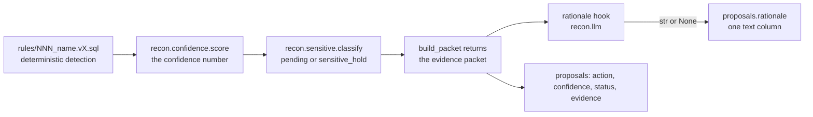

# AI Usage Disclosure

Every claim below was checked against the source in this repository. Where a number appears, it
comes from `docs/scorecard.txt`, from `prices.yaml`, or from a file cited by path — with exactly
one exception, flagged where it appears: the live-call token counts in §1 are an operator
observation with no committed artifact.

| Where AI is used | What it does | Default |
|---|---|---|
| **The reconciler** (`recon.llm`) | Writes one short paragraph of **rationale text** for a proposal a human will review. Nothing else. | `LLM_PROVIDER=mock` — offline, deterministic, no key |
| **Incident clustering** (`recon.incidents`) | Embeds a conflict descriptor and groups the vectors into `incidents`. Not on the reconcile path, no scorecard row. | `EMBEDDING_PROVIDER=mock` — offline, deterministic, no key; **lexical, not semantic — see §6** |
| **Building the repo** | Claude Code — codegen, tests, migrations, docs — with parallel subagents and independent adversarial verification of each phase. | — |

---

## 1. The reconciler: which provider and model

**Provider:** Anthropic first-party API, via the `anthropic` Python SDK.
**Model id:** `claude-opus-5` — the exact id, never a date-suffixed variant.

Set in three places, all read, all agreeing:

- `service/recon/config.py` — `llm_provider: str = "mock"`, `llm_model: str = "claude-opus-5"`,
  `anthropic_api_key: str | None = None`
- `.env.example` — `LLM_PROVIDER=mock`, `LLM_MODEL=claude-opus-5`, `ANTHROPIC_API_KEY=` (blank)
- `infra/render.yaml` — the deployed web service ships `LLM_PROVIDER=mock`,
  `LLM_MODEL=claude-opus-5`, and `ANTHROPIC_API_KEY` as a `sync: false` secret prompt

### `mock` is the default *and* the graded path — deliberately

`LLM_PROVIDER=mock` is not an evasion of the live provider; it is a determinism requirement.
The brief grades that the same input produces the same conflict set and the same confidence
vector. LLMs are non-deterministic even at temperature 0, so any model output on a graded path
would make byte-identical reproduction impossible. The mock (`recon.llm.MockProvider`) returns
deterministic text **and deterministic usage numbers**, and those numbers go through the same
`cost_microusd`, the same reservation and the same settlement as a live call — so the graded
spend-cap test exercises the real ledger rather than a simulation of one.

Selecting `anthropic` without a key **raises** `ProviderNotConfigured` and does not fall back to
the mock (`recon/llm.py:475`, `build_provider`). A whitespace-only key is treated as absent. A
deployment that believes it is calling a model while it serves canned text is a worse outcome
than a visible error.

**But be precise about where that error surfaces.** `build_provider` raises; the reconciler's
hook *catches* it. `ProviderNotConfigured` (`recon/llm.py:297`) subclasses
`ProviderNotSent` (`recon/llm.py:267`), which subclasses `ProviderError` (`recon/llm.py:256`); and
`rationale_hook_for` (`recon/reconciler.py:1361`) catches `ProviderError` and returns
`no_rationale` (`recon/reconciler.py:1324`) — deliberately, so a bad key does not
500 the hourly cron. So an operator who sets `LLM_PROVIDER=anthropic` and fat-fingers the key
gets **HTTP 200, a completed run, and every proposal `rationale = NULL`** — the only signal is
the log event `reconciler.rationale_provider_unavailable`. There is no silent *canned text*
(the mock is never substituted), but there is no failed request either. Check that log event to
confirm a live provider is actually wired; do not infer it from a green run.

### How the model is actually reached (verified against current source)

```
POST /internal/reconcile                 recon/api/internal.py
  -> register_job_handler(JOB_RECONCILE, reconcile_job)   recon/app.py  (create_app)
  -> reconcile_job(run_id)               recon/reconciler.py:1895
  -> reconcile(run_id=..., rationale=rationale_hook_for(run_id))
  -> rationale_hook_for                  recon/reconciler.py:1361
       LLM_PROVIDER=mock       -> returns `no_rationale` ITSELF (no provider built,
                                  no reservation, no prompt rendered)
       LLM_PROVIDER=anthropic  -> returns a hook calling recon.llm.generate_rationale
```

`generate_rationale` (`recon/llm.py:684`) does **reserve → call → settle**: it reserves the
worst-case cost on both mandated ledger scopes (`daily` and `run:<run_id>`) *before* the request
leaves the process, then settles the actual cost from provider-reported `usage` afterwards. The
idempotency key is derived, never random: `reconcile-rationale:<run_id>:<fingerprint>#attempt<n>`,
so a re-fired run replays instead of paying twice.

Live-call parameters (`recon/llm.AnthropicProvider`):

- `max_tokens = 384` (`DEFAULT_MAX_OUTPUT_TOKENS`) — a length limit and a cost lever, since the
  reservation is worst-case on this number
- **no `temperature`** on `claude-opus-5`. Sampling parameters were removed from that model
  family, so sending `temperature=0` is a 400. `_SAMPLING_REMOVED` lists the affected ids;
  `temperature=0` is sent only to models that still accept it
- `output_config: {effort: "low"}` — the rationale explains a decision already made
- the frozen system prompt carries the `cache_control: {type: "ephemeral"}` breakpoint, and the
  volatile evidence packet goes *after* it, because prompt caching is a prefix match
- `max_retries=0` on the SDK client — retries live in `generate_rationale`, where every attempt
  takes a fresh reservation

### What the live run demonstrated

The repository author made one live call against `claude-opus-5` with this project's key and
observed a completion with `stop_reason: end_turn` and provider-reported usage of **28 input
tokens and 28 output tokens**. Priced against the committed table (`5` and `25` microusd/token):
28×5 + 28×25 = **840 microusd** ($0.00084).

**That observation is the one number in this document that does not trace to a file.** It
produced no committed artifact — no transcript, no fixture, no audit row — and it is disclosed
here as an operator observation, not as a sourced figure. Only the *pricing* half is checkable
(`prices.yaml`); the token counts are the author's report of what he saw.

**And it was a provider check, not a graded run.** `docs/scorecard.txt` says so in its own words
under `NOT COVERED` — *"a live Anthropic provider (the graded path is the offline mock; the burst
drives the real ledger)"*. No scorecard row grades a live model call, and none should: a graded
row that depends on a non-deterministic provider is a flaky grade.

To reproduce it yourself: set `LLM_PROVIDER=anthropic` and `ANTHROPIC_API_KEY=<key>`, leave
`LLM_MODEL=claude-opus-5`, and fire `POST /internal/reconcile`. Proposals then carry
`rationale` text; leave the default and they carry `NULL`, and everything else is identical.
If they come back `NULL` under `anthropic`, the key did not build a provider — grep the logs for
`reconciler.rationale_provider_unavailable` before concluding this document is wrong.

---

## 2. The price table

`prices.yaml` at the repository root is **the only place a token price exists**.

- **Units: microusd per token**, as decimal strings. `$5.00 / 1M tokens = 5 microusd/token`.
- `claude-opus-5`: `input: "5"`, `output: "25"`, `cache_read: "0.5"`, `cache_write: "6.25"` —
  Anthropic first-party **list** pricing ($5 / $25 per 1M).
- **Money is `Decimal`, never `float`** (`recon/budget.py`, `from decimal import Decimal`). A
  float cent is a rounding error that compounds across a cap.
- **Rounding is always UP** — `_ceil_microusd` is `math.ceil` (`recon/budget.py:844`). Rounding
  can therefore only ever over-charge the ledger. A rounded-*down* fraction on every call is a
  slow leak past a cap that is otherwise exact.
- **An unpriced model is refused, not defaulted to zero.** `cost_microusd` raises
  `UnknownModelError`. A zero-cost default is not a conservative fallback — it is an unbounded
  spend path where every call reserves nothing and the cap is never reached.
- **List rates are committed, not promotional rates.** Sonnet 5 has a promo rate through
  2026-08-31; the table commits the list rate anyway, because a reservation must bound the worst
  case and an expiring promo must never silently turn a reservation into an under-estimate.
- **The mock provider is priced at the production rate**, not at zero (`mock-rationale-v1`:
  `5` / `25`). This is the choice that makes the offline default worth grading: the burst test
  drives real ledger arithmetic with no API key instead of simulating a cap. Measured, from
  `docs/scorecard.txt` → `spend-cap-burst` / `bench:spend-cap-exact`:
  `cap=81600 uUSD, contenders=120, granted=6, refused=114, reserved-while-open=81600 (== cap),
  settled spend=10782 (== 1797 × 6), ledger violations=0, over-admitted=False`.
- `version: 1` is stamped into the audit row of every priced call, so a cost recorded last week
  can be re-derived from the table that produced it.

Caps that consume the table: `DAILY_CAP_USD=5.00` and `PER_RUN_CAP_USD=1.00`
(`.env.example`, `infra/render.yaml`). Both are enforced in-app by `recon.budget` and by database
triggers — not by a gateway, and not by a comment.

---

## 3. The hard constraint: the LLM is rationale text only

**It never detects a conflict, never computes a confidence number, and never writes.** This is
the single most important architectural fact in the project, and the brief disqualifies a raw
LLM-emitted confidence number, so it is graded.



Enforced, not merely intended:

1. **By position.** `reconcile` (`recon/reconciler.py:1519`) calls the hook only *after*
   `build_packet` (`recon/reconciler.py:1216`) has returned — after detection, after
   `recon.confidence.score`, after `recon.sensitive.classify` and after the skip/dedup decision.
   The hook is handed a finished packet and its return value is typed `str | None`. Everything
   else about it is discarded.
2. **By the import graph.** `recon/confidence.py` and `recon/sensitive.py` import nothing from
   `recon.llm`, and `tests/reconciler/test_confidence_model.py:392`
   (`test_confidence_does_not_import_the_llm_module`) walks the parsed **AST** of both files and
   fails on any import of `recon.llm` or `anthropic`. A promise in a docstring is a promise; an
   import graph is a fact.
3. **By the type of the scoring input.** `score()` takes a `Signals` value object with typed
   fields, not text. `test_the_scoring_function_cannot_be_handed_text` asserts
   `score("the model says 0.99")` raises. There is no text channel into the number.
4. **By the write boundary.** `recon/llm.py` issues no data DML at all — its only database effect
   is `reserve`/`settle` on the append-only spend ledger. Model output reaches exactly two
   places: the `rationale` text column of the proposal, and an `outcome` flag on the audit row —
   the string `rationale_attached` or `rationale_null`, written by
   `_proposal_audit_row` (`recon/reconciler.py:1787`), never the text itself.
   Canonical writes are gated by three Postgres roles enforced by grants and triggers
   (migrations `0002`, `0004`, `0005`): `recon_writer` proposes, `review_writer` is the only role
   that may approve, `apply_writer` applies. No LLM path holds any of them.
5. **By failure semantics.** *The rationale is a nicety; the proposal is the product.*
   `generate_rationale` is documented and implemented never to raise — a cap hit, provider error,
   halted scope or internal fault all return `text=None` with a status.
   `_rationale` (`recon/reconciler.py:1753`) additionally wraps the hook in `try/except`. In every
   one of those cases the proposal still lands, with `rationale = NULL`. Nothing downstream
   branches on it:
   the three occurrences of `rationale` in `recon/apply.py` are a dataclass field, a `SELECT`
   column, and the assignment between them. Auto-apply gates on confidence and sensitivity, never
   on whether a model said something.
6. **By the prompt itself** — the frozen `SYSTEM_PROMPT` (`recon/llm.py:222`); any byte changed
   invalidates the cache prefix for every call:

   > "You write one short paragraph explaining, to a human reviewer, why two systems disagree
   > about a record and why the proposed fix is the likely correction. You are describing a
   > decision that has already been made by deterministic rules. Do not decide anything, do not
   > assign a confidence, do not recommend applying or rejecting, and do not invent facts that
   > are not in the evidence. Plain prose, no preamble, no bullet points, at most four sentences."

   The prompt reinforces the boundary; the code is what enforces it.

---

## 4. AI tooling used to build the project

The repository was built with **Claude Code**, using parallel subagents against a fixed task
graph, with **independent adversarial verification of every build phase** — a verifying agent
that did not do the work, whose explicit job was to find false claims rather than to confirm
them. A CodeGraph index drove symbol and blast-radius navigation instead of grep sweeps, and
skills were pinned by hash. None of those three orchestration artifacts is committed: the brief
excludes process journals from the repository, so `.gitignore` excludes the task graph, the
index and the skills lockfile deliberately. Do not go looking for them in a clone.

**The verification pattern is what found the significant defects.** A green suite is evidence
that the code behaves as the tests call it, not that the real path runs. Each of the following
was found by a verifying agent, is described in the code comment where it was fixed, and had a
passing test suite at the time it was found:

- **Routers built, tested, and never mounted.** The tests imported the router objects directly
  (or mounted them in a `conftest.py`), so they passed against a surface the running service
  never served. `/internal/*`, `/api/entities*`, the reviewer surface and `/api/scorecard` all
  404'd in the real app. `tests/integration/test_route_table.py` now asserts the route table of
  the real factory. (`recon/app.py`)
- **A scheduled trigger reporting success for work no code performed.**
  `POST /internal/reconcile` authenticated, consumed the run id, and answered HTTP 200
  `{"status": "started", "handler": "unbound"}` — with an hourly cron in `infra/render.yaml`
  pointed at it. Now bound: `register_job_handler(JOB_RECONCILE, reconcile_job, app=app)`.
- **And then those crons had still never once run.** `fromService … property: host` returns the
  service *name*, not its FQDN, so every firing since the blueprint was applied died on
  `curl: (7) Failed to connect to keystone-service-bxs8 port 443` — invisibly, because a cron
  failure shows up only in that cron's own log. The identical defect had already been found and
  fixed once in the dashboard's build command and was never swept for elsewhere; a fix applied at
  one site is not a fix. **Both trigger crons** normalise either form now, the same `case
  "$KEYSTONE_API_HOST"` the dashboard build already carried — three sites in `infra/render.yaml`,
  and three `property: host` references to match. Be exact about the third schedule rather than
  rounding it up to "all of them": `keystone-budget-sweeper` runs `python -m recon.budget sweep`
  against a `DATABASE_URL` copied `fromService … envVarKey: OPS_DATABASE_URL`. It resolves no host,
  never curled the service, and was never affected. What proves the fix is not the count anyway —
  the deployed audit log carries the `trigger.sync` and `trigger.reconcile` rows the crons
  themselves wrote through `claim_run` (`api/internal.py:277`), which is the only evidence that
  counts here, since the suite cannot test a Render schedule.
- **The rationale seam had no production caller.** `reconcile()`'s `rationale` parameter defaults
  to `no_rationale`, and nothing outside the tests passed anything else — so `recon.llm`'s whole
  reserve → call → settle chain was armed, correct, and never once exercised by the service, and
  `proposals.rationale` was `NULL` on every reachable path. `reconcile_job` now asks
  `rationale_hook_for(run_id)`, which is the wiring described in §1.
- **A 100% refund that accepted any string.** `NeverSent("trust me bro")` released 15,850
  microusd. A pre-send proof is now a closed enum member produced by classifying the transport's
  own exception, and migration `0010`'s settle trigger holds the same closed set.
- **Successful billed calls charged zero.** A response carrying real text with an absent or
  zeroed `usage` block priced at 0 — "100 successful, text-returning, billed calls were charged
  nothing." Absent usage is now `OutcomeUnknown` and charges the full reservation.
- **An overspend nothing consumed.** `settle` raised `BudgetOverspend`, it became
  `status="overspend"`, and no caller read it: 20 consecutive calls each overspending by
  ~30,000,000 microusd all proceeded. An overspend now records a durable halt on the scope.
- **The daily cap was one keyword away from being dropped.** `reserve(scopes=...)` let a caller
  choose its scopes. R17 mandates the daily cap, so it is no longer expressible as absent.
- **A PII leak through the HTTP response.** FastAPI's default `RequestValidationError` handler
  serialises pydantic's `input` member — the entire rejected object — so a bad payload answered
  the caller with the record it had just refused, through a channel none of the log-side controls
  touch. The installed handler keeps `loc`/`type`/`msg` and drops the echo.
- **`.env` read by nothing.** `env_file=".env"` resolved against the process working directory,
  which is always `service/`, so the repo-root `.env` that `cp .env.example .env` creates was
  never opened: `make serve` came up looking healthy, then answered 503 on `/health` and 401 on
  `/internal/sync`. The chain is now anchored to the repository.

---

## 5. Configuration that materially shaped the solution

**Determinism rules** (the dataset, conflict set and confidence vector are graded on byte-identical
reproduction):

- **One seeded RNG.** `recon/seed/rng.py` threads a single `random.Random(seed)` through the whole
  generator; child streams are derived as `random.Random(f"{seed}:{label}")`. No module-level
  `random.*`, no `uuid4()`, no `datetime.now()` on a graded path.
- **`PYTHONHASHSEED=0` is set and asserted, not requested.** The variable is read at interpreter
  startup, so `recon/seed/__main__.py` re-`exec`s once with it in the environment (sentinel-guarded
  against looping) and then asserts the value it ended up with. A run started at
  `PYTHONHASHSEED=random` cannot silently complete with a green manifest.
- **Canonical JSON everywhere.** `json.dumps(obj, sort_keys=True, ensure_ascii=True,
  separators=(",", ":"))` — `canonical_json` (`recon/privacy.py:1260`). The same spelling is used
  for the proposal's `evidence` column *and* for the rationale prompt, so the prompt for a given
  packet is byte-stable and the reservation's input bound is computed from a stable string.
- **Pinned seed `20260822`**, in `.env.example`, `infra/render.yaml` and `recon/config.py`.
  Changing it invalidates `golden/`.
- Measured (`docs/scorecard.txt`, `determinism` row): `dataset 642d160a46bfdf75 ==
  642d160a46bfdf75 over 21 files`, `conflict set 3050 fingerprints, payload 77cf192e9e79b5cb ==
  77cf192e9e79b5cb`, `confidence vector 3050 entries, 7ccd8926684645cc` across two independent
  subprocess runs and the committed golden set.

**The shared-normalization rule (R23).** `recon/normalize.py` is one module imported by **both**
the seed generator and the detector — `recon/seed/dirt.py`, `build.py`, `golden.py` and `sweep.py`
all import from it, and the generator imports nothing else from detector code. Planted dirt is
verified to normalize *back* to its clean canonical (`dirt.py` raises if it does not), so the
golden set cannot drift away from what the detector actually sees. Measured consequence
(`docs/scorecard.txt`, `bench:conflict-accuracy`): `precision 1.000000 recall 1.000000 on 3050
golden entries (FN=0 FP=0 field-mismatches=0)`.

**Scorecard** (`docs/scorecard.txt`, `generated 2026-08-26T07:39:39+00:00`): 16/16 checks passed,
combined coverage 93.1% over the seven core modules against a floor of 80%, measured by a real
pytest run — 4,771 passed, 2 skipped, in 1949.13s. That file is a generated artifact and it is
regenerated against a rebuilt database rather than hand-edited. This paragraph used to carry a
caveat that the scorecard predated the rationale wiring described in §1 and that its coverage
figure was therefore an earlier tree's; **that caveat is gone because the run is now later than
the wiring**, not because it was argued away. The graded figures were never affected either way:
under the `mock` default `rationale_hook_for` returns `no_rationale` itself, so the dataset,
conflict set and confidence vector a run produces are byte-identical to what they were before that
function existed.

---

## 6. The second AI component, and the two doors that were shut in front of it

`recon/incidents.py` embeds a conflict descriptor and clusters the vectors into `incidents`.
`EMBEDDING_PROVIDER` defaults to `mock` (deterministic salted-BLAKE2b feature hashing, 256
dimensions, no network, no key); the live options are `voyage` → `voyage-3.5` and `openai` →
`text-embedding-3-small`.

**Until 2026-08-24 this component was written, tested, mounted — and could not run.** Two
independent blockers, and both of them had a green test suite in front of them:

1. **Not priced.** None of the three embedding model ids — `mock-embedding-v1` included — was in
   `prices.yaml`, and `build_embedding_provider` calls `_require_priced(model, ...)` *before* it
   branches on the provider name, so the offline default refused as loudly as a live one:

   ```
   $ uv run python -c "from recon.incidents import build_embedding_provider; build_embedding_provider('mock')"
   EmbeddingProviderNotConfigured: EMBEDDING_PROVIDER='mock' is priced on model
   'mock-embedding-v1', which is not in the committed prices.yaml -- so recon.budget.reserve
   cannot size a reservation for it and migration 0010's reserve trigger would refuse one anyway
   ```

   The tests were green anyway, and `service/tests/incidents/conftest.py` said why in its own
   docstring: an `embedding_prices` fixture supplied the missing rates, "standing in for the
   migration that would price them". Disclosed stub-blindness is better than hidden stub-blindness
   and is still a feature that does not start.

2. **No production caller.** `cluster_conflicts` had no call site outside `service/tests/incidents/`
   — no CLI, no job, no pipeline stage — while `recon/suite/pipeline.py` truncated
   `conflict_incidents` at the start of every graded pass. So on the documented path
   (`make sync` → `make reconcile` → `make suite`) `GET /api/incidents` returned
   `{"items": [], "total": 0}` for ever, with the router correctly mounted. Verified against the
   database a real graded pass left behind: 3,050 conflicts, **0** incidents, 0 members.

**Both are closed now, and the fail-closed door was kept.** `prices.yaml` version 2 prices the three
models (Voyage and OpenAI list rates, captured 2026-08-24; the mock at the higher of the two, for the
reason `mock-rationale-v1` is priced at a production rate — a free mock makes "the embedding path is
metered" a claim about a no-op), migration `0016_price_embedding_models` seeds `budget_model_prices`,
the stand-in stopped standing in — `embedding_prices` supplies **nothing** now and instead fails if
the database it is about to reserve against does not already carry the committed rates, which is the
opposite of what it used to do — and two real callers write the rows: `python -m recon.incidents` and
step 9 of the graded pass, which regenerates the incidents that same pass truncates. The refusal
branch was *re-pointed*, not removed — `test_an_unpriced_model_is_still_refused_at_build_time` now
hands `build_embedding_provider` a price table with the model taken out, so the door that stops an
unpriced model reserving zero is still under test, for all three providers.

**What is still true and is not claimed away.** The `mock` embedding is **lexical**, not semantic —
it measures token overlap. The clustering is `GROUP BY type` refined by the shape of the disagreeing
values (19 column-wise groups become 38 incidents on the golden set) and it never merges two conflict
types — but it also does **not** refine that key once `oscillating` is added to it, which is a
limitation `service/tests/incidents/test_golden_counts.py` pins rather than tunes away. README's
"What `GET /api/incidents` does and does not do" carries every measured number, including the two
that cut against the feature. `VoyageEmbeddingProvider.embed` and
`OpenAIEmbeddingProvider.embed` have **never been executed** — the suite is keyless, so their request
shapes are unverified and a first live run is the only thing that can confirm them. There is no
dashboard panel and no scorecard *row*; the graded pass reports the stage as a scorecard note
instead, in both directions. Nothing on the reconcile path depends on any of it.

---

## 7. No personal data

Every record in `fixtures/` and `golden/` is synthetic, generated by `python -m recon.seed`. No
real names, emails or dates of birth appear anywhere in the repository. Prompts sent to a live
provider *do* carry synthetic personal data from the evidence packet, which is the documented
contract of `recon.llm.RationaleRequest` (`prompt` may; `subject` must not — it is the conflict
fingerprint). Anything logged from that path is redacted to hash+preview by
`recon.logging.audit_detail` in `LOG_MODE=safe`, which is the default and what
`infra/render.yaml` deploys, and redaction is applied in the module body as well as by the
structlog processor chain, so a payload built there is safe even in a process that never
configured a logger.
