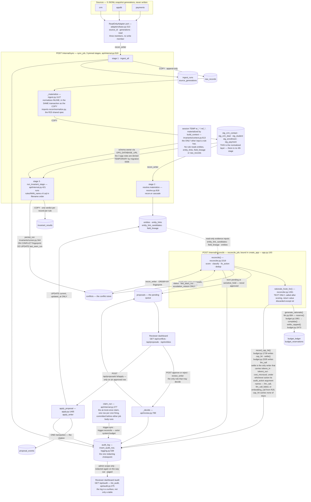
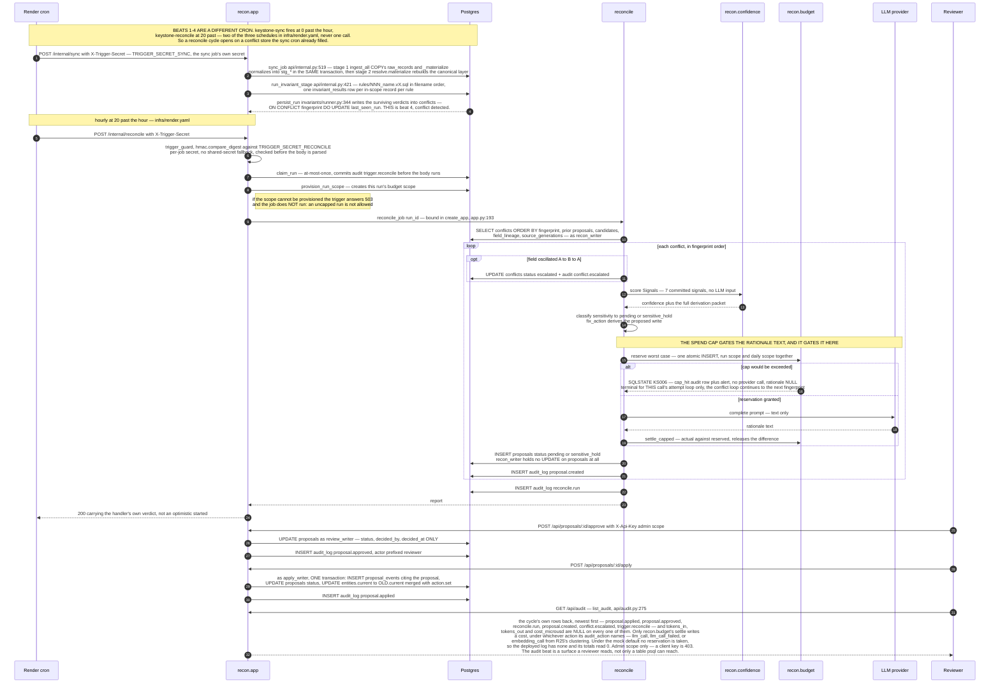

# Keystone — Architecture

Three read-only sources disagree. Keystone lands them, normalizes them against one shared spec,
resolves identity, runs a committed SQL rule set that emits a per-record verdict, turns the surviving
conflicts into **proposals that no machine may approve**, and lets a human decide. Every mutation of an
existing canonical row must cite the proposal that authorized it, in the same transaction.

Both diagrams below were drawn from the code as it stands, not from a design doc. Every code citation
names a symbol, and **what is enforced on every run is the symbol, not the integer**:
`service/tests/docs/test_doc_citations.py` re-reads every `path:line` reference in this file and goes
red when the cited file no longer *defines* what the prose names — a rename, a deletion, a move to
another module — or when a reference has slid onto a mere mention of it (an `__all__` entry, an
import, a comment). The line numbers themselves are **not** continuously enforced, deliberately: a
doc test that reddens because an unrelated commit moved a function four lines down is a gate people
learn to ignore, and this one did exactly that once. They are re-derived from the working tree by
`cd service && uv run python -m tests.docs.test_doc_citations --write`, which was last run to
produce the numbers below. So read a line number as *exact as of the last resync*, and the symbol
beside it as guaranteed.

---

## 1. Data flow



Two things this diagram deliberately does **not** show, because the code does not do them:

- **There is no raw → staging → normalized three-step.** `stg_*` *is* the normalized layer.
  `_materialize` (`ingest.py:1127`) runs inside `_land_records`, in the same transaction as the
  landing `COPY`, and calls `recon.normalize` directly.
- **No arrow from `entities` into the invariant engine.** Grepping every `FROM`/`JOIN` in `rules/*.sql`
  returns only `stg_crm_contact`, `stg_crm_deal`, `stg_student`, `stg_enrollment`, `stg_payment` and
  the session-scoped TEMP `er_*` / `ref_*` tables that `build_context` (`invariants/context.py:613`)
  materializes. No rule references `entities`, `entity_links`, `entity_link_candidates`, `field_lineage` or
  `raw_records`. The canonical layer feeds the *reconciler*, not the detector.

The audit fan-in is every caller of the chokepoint but one: `run_purge` (`privacy.py:1672`) writes the
retention sweep's own row, and that is an ops CLI rather than a pipeline stage. The `claim_run` arrow
is the one that matters most on the *deployed* instance, which is why it is drawn rather than left to
the prose: until a reviewer decides something there, `GET /api/audit` reports two actors —
`system:budget` and `system:reconciler` — and `trigger.sync` / `trigger.reconcile` are two of the
five actions present. `system:budget` is the actor `claim_run` writes under — one of only two the log
has, and it had no arrow into `audit_log` at all until this one was drawn. Which modules may contain
an `INSERT INTO audit_log` is published as data rather than prose — `AUDIT_WRITERS`
(`logging.py:634`), which `tests/privacy/test_sinks.py` compares against the INSERT sites it finds
in the source, so a new writer cannot appear unnoticed.

One label needs a footnote. The three-column `conflicts` grant is what migration
`migrations/versions/0015_escalation_reason_grant.py` establishes. `docs/scorecard.txt` used to carry
two notes saying `escalation_reason` was *not* writable by `recon_writer`, because it had been
generated against a database one migration earlier; **that has since resolved itself the way it was
predicted to**. The current scorecard was regenerated against a database at head and carries the
opposite note — *"conflicts.escalation_reason IS writable by recon_writer (migration 0015)"* — and its
`oscillation-dedup` row reports `escalation_reason on the row 25/25`. The reconciler is correct either
side of it: it asks `has_column_privilege` once per run and escalates with the columns it actually
holds, reporting `escalation_reason_persisted`, and the reason always reaches the
`conflict.escalated` audit row.

---

## 2. One reconcile cycle



**All nine beats are above, but the first four are not the same HTTP call.** Sync, the invariant
check and conflict-detected run under `keystone-sync` (`"0 * * * *"`); the five beats from
`reconciler proposes` onward run under `keystone-reconcile` (`"20 * * * *"`) — both in
`infra/render.yaml`, and the `Note over` marks the split. A reconcile cycle therefore opens on an
already-populated conflict store. Drawing them as one call would show a pipeline that does not exist.

**Where the beat *order* diverges, and why the code is right.** The brief lists
*"reconciler proposes → spend-cap check → write pending"*. In the implementation the cap gates the
**rationale text**, not the proposal: `reconcile()` calls `_rationale` (`reconciler.py:1627`) and
only then `_insert_proposal` (`reconciler.py:1628`) — adjacent statements, in that order. The cap
check lives inside `recon.llm`'s `generate_rationale` (`llm.py:684`), which takes the reservation
with `reserve` (`budget.py:1861`), makes the call, and hands the difference back with
`settle_capped` (`budget.py:2473`). There is no cap check between the proposal and the pending
write because **writing a proposal costs nothing** — the only money in the cycle is the model call,
and it is reserved before it is made. Drawing a
separate gate after the proposal would show a control that does not exist.

**What a `KS006` actually does — on every path that can raise one.** One half is the same
everywhere: the reserve trigger refuses the INSERT, `reserve` raises `BudgetCapExceeded`
(`budget.py:515`), **nothing is charged and no provider call is made**, and the refusal writes its own
`cap_hit` audit row and fires the alert (`record_cap_hit`, `budget.py:1739`). Spend is bounded because
the reservation strictly precedes the request: *no reservation ⇒ no provider call.* The sentence the
trigger raises now says exactly that and nothing more — migration `0017_cap_message_states_refusal`
replaced the old tail `-- halt the run` with `-- this reservation is refused and nothing was
charged`, leaving the SQLSTATE, the raising condition, the `FOR UPDATE` ledger lock and the grants
untouched. The mechanism was always right; the message was the part that issued an order, and an
error string is read as an instruction by whoever has to act on it. **What stops
besides the spend is the caller's decision, and the two callers differ** — so this says which, rather
than saying "halt", which is what this section used to do while one of the two performed no halt at
all:

- **The reconcile cycle degrades and does not halt.** `generate_rationale` (`llm.py:684`) catches it,
  ends **that one call's** attempt loop — a cap hit is terminal, retrying only produces another
  `KS006` — and returns a `cap_hit` outcome with `text=None`. Nothing above it is told. `_rationale`
  (`reconciler.py:1753`) turns that into `None`, the proposal lands with `rationale = NULL`, and the
  **next** conflict in fingerprint order takes its own reservation and is refused the same way: one
  `cap_hit` row and one alert per refused attempt, not one per run. No caller in `recon.reconciler`
  inspects a cap status, breaks the loop, or aborts the run.
- **The metered batch job halts.** `python -m recon.incidents` lets `BudgetCapExceeded` propagate out
  of its embedding pass and `main` (`incidents.py:1429`) returns `EXIT_REFUSED` — a non-zero exit,
  logged and alerted.

The reconcile-side degradation is deliberate, not a gap left open. The LLM is rationale *text* and
nothing else, so ending a detection run because its nicety budget is gone would drop conflicts the cap
has nothing to do with; and the obvious alternative — a process-side latch that stops attempting once
the cap has spoken — is exactly the Python-side cap check `recon.budget` refuses to have, because it
answers "is there budget?" without asking the database. `recon/budget.py`'s module docstring
(§*What "stop on cap" actually stops*), `recon/llm.py`'s (§*Every attempt reserves*) and
`docs/DESIGN.md` §Budget ledger state the same two paths.

Note also that under the default `LLM_PROVIDER=mock`, `rationale_hook_for` (`reconciler.py:1361`)
returns `no_rationale` — *the identical function object* — so every graded run makes zero model calls,
reserves nothing, and produces byte-identical proposals. The `alt` branch above is the live-provider
path.

---

## 3. Rationale

**Adapter boundary.** `ReadOnlyAdapter` (`adapters/base.py:313`) is a `@runtime_checkable` Protocol
with exactly three members — `source_id`, `generations()`, `read()`. No write method: a source is a
snapshot you pull. **Proven, not asserted**:
`assert_sources_are_unwritable()` (`apply.py:1885`) walks every adapter's full MRO **and its instance
`__dict__`** — a writer bound at construction lives on no class — and returns three class names, zero
offenders. The load-bearing arm is the Protocol's missing member; the assertion is a backstop that
publishes its own limits (Appendix A).

**Holds before writes — enforced where.** In the database, in the same transaction as the write. An
`UPDATE` of `entities.current` is accepted only when, in that same transaction, a `proposal_events`
row names that `canonical_id`, records `before`/`after` as the pre- and post-update values (compared
by jsonb equality *and* textually), cites an `approved` (or applying-in-this-transaction) proposal
whose `target_canonical_id` is that entity, and the new value equals `OLD.current || action->'set'`
exactly. Citations are single-use (partial unique indexes); a reversal may only undo the write on top.
Beneath that, three roles with column-scoped grants, connected as **real logins, never `SET ROLE`** —
`role_connection` (`db.py:286`): `recon_writer` PROPOSES (rows born `pending`/`sensitive_hold`; it
holds no UPDATE on `proposals` at all), `review_writer` DECIDES (`proposals(status, decided_by,
decided_at)`), `apply_writer` APPLIES (`entities(current, updated_at)` only, no INSERT). No code path
can skip the hold, because no code path holds a role that could. Four things this does **not**
guarantee — creation is not citation-guarded, the schema owner is not bound — are in Appendix A.

**The spend cap — why it cannot be bypassed.** It lives in the database, not in Python, and the capped
party was left **no writable spend column at all**: `recon_writer` holds neither INSERT nor UPDATE on
`budget_ledger`, and spend moves only under the `budget_reservations` triggers. `reserve` is one
atomic `INSERT` whose `BEFORE INSERT` trigger locks the ledger row, checks `spent + reserve <= cap`
and raises `KS006` otherwise — reserved **before** the call, so a burst cannot race post-call
accounting — and it has **no `scopes` parameter**, so nobody opts out of the daily cap.
`ck_budget_spent_within_cap` (`0001_initial_schema.py:629`) is the CHECK backstop. On the reconcile
path a `KS006` ends that call's attempt loop and nothing wider — the proposal still lands, with
`rationale = NULL`; the metered batch job `python -m recon.incidents` exits non-zero instead. §2 has
both paths in full. The cap binds spend *before* a call, not the release after one — Appendix B.

**One change to scale 100k → 10M: detect incrementally over a *persisted* ER projection instead of
rebuilding the whole world in Python every sync.** Stage 3's `build_context`
(`invariants/context.py:613`) → `load_snapshot` (`invariants/context.py:265`) pulls every row of all
five `stg_*` tables into Python lists and re-runs the global `recon.er.resolve` cascade in process —
work stage 2 (`resolve.materialize`, `resolve.py:818` → `resolve_generation`, `resolve.py:441`)
already did and persisted. One sync runs that cascade **twice**, holding the whole world in RAM both
times: the wall is memory, not CPU. So: have stage 2 write the `er_*` projection once, persistent
and generation-keyed; point `invariants/context.py` at it; parameterise the rules on the keys the
landed generation touched. Measurements, and the 7 rules that cannot be delta-scoped: Appendix C.

---

## 3a. Appendix to the rationale

*Deliberately outside the one-page rationale above, and not a correction of it. This is the part that
did not fit: the caveats each boundary publishes about itself, and the numbers behind the scaling
claim. A boundary stated without its limits is a boundary nobody can audit, so none of it is dropped.*

### A. What the adapter and write boundaries do **not** guarantee

`assert_sources_are_unwritable()` publishes its own limit in its own docstring: `WRITE_NAME_TOKENS`
(`adapters/base.py:93`) is a substring list, not a decision procedure, and the sweep is exactly as
exhaustive as the list is. It carries seventeen verbs now, including `persist`, `commit`, `flush`,
`sync`, `emit` and `land` — this codebase's own word for the write — so an adapter defining any of
those is **refused here rather than passing**. The gap that closed was in the code, never in this
appendix: `assert_sources_are_unwritable`'s own docstring used to say that an adapter with
`def persist(...)`, `def commit(...)`, `def flush(...)` or `def sync(...)` *"carries no listed token
and passes here"* (`git show d8a120a^:service/recon/apply.py`), and the list was widened until that
stopped being true. `tests/ingest/test_write_token_widening.py` builds a write-back connector for
each of the **six** verbs that widening added — `_NEWLY_COVERED`
(`tests/ingest/test_write_token_widening.py:49`) — and requires both the ingest-side predicate and
this sweep to refuse it, so those six are a property of the list rather than a reading of it. The
other eleven are not: no test defines `def upsert` or `def truncate` on a connector, so their
coverage is still read off the tuple, checked only against adapters that have no such method.
Widening is bounded by the read-side vocabulary: `emit` could only be listed once
`FaultInjectingAdapter`'s read-side counter was renamed from `emitted` to `records_handed_over`,
because the match is on substrings.
Any verb not on the list — `store`, `apply`, a vendor SDK's own word — is still
uncovered, and nothing decides the general case. It and `source_tree_digest()` (`apply.py:1971`,
which hashes the whole fixture tree either side of a real committed apply and rollback) are reached
only from tests; the load-bearing arm is the Protocol's missing write member, not either of them.

1. **Canonical CREATION is not citation-guarded, by design** — the pipeline may APPEND, only the
   guarded path may MUTATE. `recon_writer` holds INSERT on `entities`; the INSERT-side check is
   provenance, not authorization (`KS008`: a canonical row must descend from an `entity_links` row),
   so fabricating one costs three INSERTs rather than a proposal.
2. **"Exactly one canonical write" means one write of `current`, not one UPDATE statement** — under an
   evidence-only `{"set": {}}` approval, repeated no-op UPDATEs of other columns satisfy the rule.
3. **The schema owner is not bound, on either environment.** Locally it is a superuser, so
   `SET session_replication_role='replica'` disables every trigger for the session with no DDL. Neon's
   `neondb_owner` is not, and that is refused — but `ALTER TABLE ... DISABLE TRIGGER` needs only table
   ownership, so it still lands. Neon removes the *silent, session-scoped, no-DDL* bypass, not the
   bypass. The boundary binds the three **application** roles, never the owner.
4. **The database checks authorization, not correctness.** The action CHECK pins the *shape* of
   `proposals.action`, and `ck_proposals_sensitive_covers_write_set` (migration 0012) refuses a
   `sensitive = false` proposal whose `action->'set'` names any `SENSITIVE_FIELDS` path — but nothing
   verifies the fix is the *right* one for its conflict, only that the write matches the action.

### B. The spend cap — measured, and where it stops binding

A Python-side cap once fell to a red team zeroing `budget_ledger.spent_microusd`, which is why the
capped party ended up with no writable spend column. Real burst (`docs/scorecard.txt`): **120
contenders, 6 granted, 114 refused, every refusal `KS006`; cap 81,600 µUSD, reserved-while-open
81,600 = exactly the cap; settled 10,782 = 6 × 1,797; ledger violations 0; over-admitted false; retry
wave 10 → 0 granted.**

What that does **not** cover: it binds what may be spent **before** a call, not the **release**
after one. `recon_writer`'s `UPDATE` on `budget_reservations` is column-scoped but carries no row
predicate, so one statement settling every `state = 'open'` row as `never_sent` at `actual = 0` hands
back other runs' reserves too — on a scratch database that took two full run scopes from `spent = cap`
to `spent = 0`, and the next reservation was granted. Migration 0010 bounds *which* rows that may
touch — `ops_attested_outage` is refused to `recon_writer`, and a `never_sent` claim on a reservation
older than `NEVER_SENT_WINDOW_SECONDS = 60` is refused `KS007` — but not how many, and no trigger can
tell a truthful pre-send failure from a fabricated one.

### C. The scaling change — the measurement behind it

Measured (`api/internal.py:114-117`; dataset `docs/scorecard.txt:4`): first sync 58.3s = 22.3 ingest
+ 22.1 materialize + 13.8 invariants over 360,400 records; `bench:detect-persist-reconcile` already
burns 24.22s of its `<30s` budget — 81% — at 3.6% of target volume, and that row **excludes**
materialization, which the same suite run re-timed live at 14.22s. The scorecard adds the two
unrounded and reports the end-to-end pass — materialize plus the three stages — at **≥38.43s**
(`docs/scorecard.txt:70-84`; 12.72 + 2.68 + 8.81 = 24.21, plus 14.22, which is why it is 38.43 and
not the 38.44 the rounded total suggests). It does not fit 30s even at today's volume; and
376,000 `invariant_results` rows land per sync (`api/internal.py:92-93`), hourly.

Two properties already make the incremental plan safe: `persist_run`'s `ON CONFLICT (fingerprint) DO
UPDATE SET last_seen_run` (`invariants/runner.py:344`) makes re-detection idempotent, and
`ABSENCE_RULES` (`invariants/rules.py:44`) names the 7 of 14 rules that fire on a record *not*
existing — those cannot be delta-scoped and move to a periodic full pass.

---

## 4. The confidence model

Deterministic, inspectable, and it is **not** a hardcoded constant and **never** an LLM number.
`recon/confidence.py` imports nothing from `recon.llm`, and `score()` takes a `Signals` value object,
not text — "we did not do it" is a promise and an import graph is a fact. All 14 bases and all 7
weights live in the committed **`confidence.yaml`** (repository root); the evaluator holds no number of
its own beyond the `decimal` precision (`_PRECISION = 28`), two `Decimal(0)` accumulator seeds and the
`Decimal(1)` that builds the quantum. A missing or malformed model file **raises**; it never defaults,
because a model that degrades to hardcoded numbers when its file is unreadable is a hardcoded model with
extra steps.

### The formula

```
clamp01(clamp01(base[conflict_type] + sum(positive)) + sum(negative))
```

pinned as a literal string in the model's `formula` key (`confidence.yaml:65`) and asserted verbatim
in the suite. Ordered
procedure: pin the `decimal` context inside `localcontext()` so a caller cannot reach in; read the
base; walk `signal_order` accumulating each `weight × value` into the positive or negative half **by
the sign of the committed weight** (a count signal scoring 0 is still a penalty term, or a zero-valued
penalty drifts into the positive half); clamp the positive half; add the negatives; clamp again;
**quantize exactly once** at the end to 4 places, `ROUND_HALF_EVEN`, matching
`proposals.confidence NUMERIC(5,4)` so the stored value is the computed value.

### The seven signals

| # | Signal | Weight | Kind | Fires when |
|---|---|---|---|---|
| 1 | `hard_external_id_agreement` | **+0.35** | boolean | a gen-3 `entity_link_candidates` row with `key_class='ext'` links one of the conflict's `crm:contact:` refs to one of its `appdb:student:` refs, and every key class that resolved lands on a common student |
| 2 | `normalized_email_agreement` | **+0.25** | boolean | same test on `key_class='email'` — independent of #1, so they add |
| 3 | `name_dob_exact` | **+0.20** | boolean | same test on `key_class='namedob'`; `normalize.match_keys` emits no namedob key unless first, last and dob are all present |
| 4 | `amount_date_corroboration` | **+0.10** | boolean | `corroborating_keys[type]` is non-empty **and** every key in it is present and non-null in `observed_values`. Empty list ⇒ 0 by construction |
| 5 | `disagreeing_field` | **−0.10** | **count** | per distinct `COMPARED_FIELDS` comparison **row** in `disagreeing_fields`. The row, not the path — a disagreeing comparison puts *both* source-qualified endpoints in the set. Only C6 and C14 populate it |
| 6 | `partial_evidence` | **−0.15** | boolean | any of: an incomplete gen-3 source; a null/empty pinned `observed_values` entry (but not `False`/`0`); fewer than two distinct sources; two match-key classes resolving one source record to two different entities |
| 7 | `oscillation_observed` | **−0.25** | boolean | the underlying field went A→B→A across three ascending generations, per `scan_field_lineage` over `field_lineage` — or, when that scan has no rows to read, per the `conflicts.oscillating` column the invariant run stamped. The packet records which of the two answered |

### The 14 bases

The base answers one question — *given only that this rule fired, how much of the FIX is already
determined?* — not "is the conflict real"; the engine grades 0 FP / 0 FN against the golden set, so
every conflict here is real. A type whose repair value is read straight off the authoritative record
starts high; one that needs a human to choose between two records starts low.

| | | | | | | | |
|---|---|---|---|---|---|---|---|
| C1 paid-but-no-deal | 0.50 | C2 payment-no-person | 0.35 | C3 duplicate-by-email | 0.45 | C4 same-person-diff-emails | 0.50 |
| C5 one-source-only | 0.50 | C6 field-disagreement | **0.40** | C7 enrolled-unpaid | 0.50 | C8 dropped-sibling | 0.45 |
| C9 stale-pointer | 0.55 | C10 merge-collapsed | **0.30** | C11 duplicate-payment | 0.55 | C12 wrong-amount | 0.55 |
| C13 refund-not-reflected | 0.55 | C14 sensitive-field-only | **0.40** | | | | |

Totality is enforced at parse time: a missing base, or a base for an unknown type, is a hard error.

### Why it clamps twice

Version 1 was `clamp01(base + sum(all))`. That quietly discounted — usually to nothing — every penalty
on a conflict whose positive evidence had already carried the total past `clamp_max`. Measured on the
graded 3,050-proposal store (`confidence.yaml:53`): **1,057 proposals have positive evidence that alone
saturates the clamp, and 191 of those carry a penalty**, which under v1 changed the stored number by
nothing on 181 of them. Two proposals with identical positive evidence, one additionally flagged as
resting on partial evidence, stored byte-identical confidences. That is not "lowered by partial
evidence", and R14 clause (c) requires that it be. Clamping the positive half first and subtracting
after fixes exactly that and nothing else:
wherever `base + sum(positive) ≤ clamp_max` the two versions are arithmetically identical, so no score
outside the saturated region moved, and **no base and no weight changed in the v1 → v2 bump**. The
rejected alternative — rescaling weights so saturation is unreachable — would have moved every score
that was never wrong.

Worked example, pinned as a test: C6 with all three identity signals and one disagreeing row is
`0.40 + 0.35 + 0.25 + 0.20 = 1.20 → clamp → 1.0000`, then `− 0.10 = **0.9000**`, with `raw_total 1.10`,
`positive_total 0.80`, `negative_total −0.10`, `positive_clamped true`, `clamped false`. That test
previously asserted `1.0000`; the old expectation encoded the defect as the contract.

### The ceiling — the gate working in both directions

**C6 and C14 ceiling at exactly 0.9000 and can never auto-apply,** and this is structural rather than
incidental. `R-006` and `R-014` are the only rules that populate `disagreeing_fields`, and both build
that set from rows `WHERE disagrees` — so every one of the 500 C6 and 50 C14 conflicts in the graded
set carries at least one disagreeing row (0 of 550 are empty). Clamp #1 caps the first term at
`clamp_max = 1.0000` for *every* type, independent of the base, so one disagreeing row at −0.10 always
lands after saturation: ceiling `1.0000 − 0.10 = 0.9000`, permanently below R24's
`AUTO_APPLY_CONFIDENCE_FLOOR = 0.95`. Brute-forcing every signal configuration through the real
`score()`, and re-counting `golden/conflicts.json` through the real `disagreeing_row_count`:

```
C6:  MAX with d>=1 = 0.9000   MAX with d==0 = 1.0000   auto-appliable at d>=1 = False
C14: MAX with d>=1 = 0.9000   MAX with d==0 = 1.0000   auto-appliable at d>=1 = False
golden (type, ROW count): {('C6',1):420, ('C6',3):80, ('C14',1):20, ('C14',2):30}
total C6+C14: 550   with ZERO disagreeing rows: 0
```

A guard test derives the ceiling *from the loaded model* — weight, sign and formula shape — so a model
change goes red rather than silently wrong.
C14 is separately and independently immune: `_ALWAYS_HELD_TYPES = {"C14"}` holds every C14 on the
strength of its type before any path or score is consulted, so the ceiling is load-bearing only for C6.

The consequence is stated rather than hidden (`docs/proposal-policy.md` §8): the one auto-apply-
eligible path that the entity view projects is a C6's fix target, and no C6 can reach 0.95; the
proposals R24 *would* take unattended write exactly `{appdb.enrollment.crm_deal_id}` — 50 C9
stale-pointer fixes at ≥0.95 — and that path is not in `recon.resolve.VIEW_FIELDS`. So the honest
count of proposals that are both auto-appliable and observable is **0**. That is the gate working in
both directions, not a defect: sensitivity is a pure function of the target field path, evaluated
**before** confidence and winning over it at every score including 1.0. Putting a sensitivity term in
the formula would make the hold a matter of arithmetic, which is the one thing R15 forbids.

### Determinism, and what the model says about itself

No binary float is ever constructed: every YAML numeric must be a **quoted string** and the parser
refuses any other type outright (`Decimal(0.35)` is `0.34999999999999997779…`), with a regex scan over
the file *text* catching an unquoted literal that every other test would pass. The context is pinned,
not inherited. Terms sum in the committed `signal_order`. There is exactly one quantization. The model
is identified by the **sha256 of its raw bytes**, computed before parsing and stamped into every
evidence packet as `model_sha256`, so an edit that forgets to bump `version` is still visible on every
row written afterwards. Every ordering hazard was searched for and closed at parse time — two signals
sharing a `key_class` is refused, more than one signal defining `corroborating_keys` is refused, and
every set is either reduced to a `len()` or emitted sorted.

`Score.as_dict()` persists the whole derivation into `proposals.evidence['confidence']`: model version
and digest, the formula string, base, every term with its value/weight/contribution, all four totals,
both clamp flags, the precision block, and the raw signals. **A reviewer holding one row can re-derive
its number without the repository.**

Two weaknesses the model self-reports in `confidence.yaml`, kept because overstating discriminating
power is worse than admitting it: signal #4 is **constant within every type** on this dataset (1 for
C1/C11/C12/C13, 0 for the other ten), so it "contributes what adding 0.10 to four bases would"; and
clause (c) of signal #6 is fixed by conflict type for C2/C3/C5/C11, while the term itself varies
per-instance only within C8 and C9, and there via clause (b). The three identity signals are what
actually vary within a type.

One accuracy note: the `[0,1]` bound is guaranteed by the committed `clamp_min`/`clamp_max` values and
asserted in `test_confidence_yaml.py`, not validated inside `_parse`. Since that same test pins the
file's sha256, any drift is a red build — but the range is test-enforced, not code-enforced.

---

## 5. Why plain versioned SQL invariants, not dbt-expectations

Deliberately dbt-expectations-*equivalent*, and deliberately not dbt. **Per-record verdicts are the
grading contract**: `invariant_results` carries one row per in-scope record per rule per run, with the
verdict and the reason. dbt's `store_failures` overwrites per run and does not reliably emit full
rows, so it cannot answer "which rules judged this record on that run" — which is the question the
whole audit story rests on. Keeping the rules as `rules/NNN_name.vX.sql` also keeps them versioned in
the same repo as the code that runs them, lints them at load time, and loads them in deterministic
filename order. Rejected: the full dbt toolchain. (`docs/DESIGN.md` §Decisions & rationale.)
