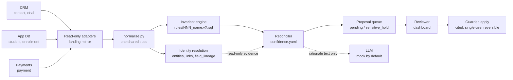

# Keystone — the reconciliation trust layer

Keystone mirrors three **read-only** upstream sources, resolves them into one identity layer,
detects cross-source conflicts against **versioned, committed SQL invariants**, and files each one
as a **proposal a human approves before anything is written**. An LLM writes rationale text and
nothing else: it never detects a conflict, never computes a confidence score, and never writes.

Everything runs offline on synthetic data with **no API keys**. The dataset, the golden set and the
scorecard are all reproducible from one committed seed.

**Status: complete.** The committed grading-harness run — `2026-08-26T07:39:39Z`, in
[`docs/scorecard.txt`](docs/scorecard.txt) — reports **16/16 PASS**, and it grades **this** tree: a
database rebuilt from the committed seed at that commit, not an older snapshot. See
[Results](#results).



**No rule reads `entities`, `entity_links` or `field_lineage`.** The invariant engine reads the
normalized `stg_*` layer plus the session-scoped TEMP `er_*` tables it rebuilds from it; the
persisted canonical layer is read-only evidence for the reconciler and the query API.

Full rationale and the two required diagrams: **[ARCHITECTURE.md](ARCHITECTURE.md)**.
AI tooling disclosure: **[AI_USAGE.md](AI_USAGE.md)**.

---

## Deployed application

- **Dashboard:** <https://keystone-dashboard-2rot.onrender.com>
- **Service:** <https://keystone-service-bxs8.onrender.com> — `/health`, `/docs`, and the client API
- **Demo key:** send `X-Api-Key: keystone-demo-admin-8c25e0b71a94f36d` — committed on purpose and
  documented in [`.env.example`](.env.example); the dashboard already sends it

Render appends a suffix when a service name is taken globally, which is why the hosts carry
`-2rot` / `-bxs8` rather than the bare names the blueprint asks for.

**The deployed instance carries the graded dataset.** It runs `--profile full`: 360,400 landed
records across 3 generations, 43,375 entities, 120,000 `entity_links`, 1,279,575 `field_lineage`
rows, 3,050 conflicts, 3,050 proposals (2,670 `pending` + 380 `sensitive_hold`). All 14 conflict
types sit at exactly their golden counts on the deployed database — C1 500, C2 200, C3 300, C4 250,
C5 400, C6 500, C7 300, C8 150, C9 100, C10 50, C11 50, C12 100, C13 100, C14 50. Neon's free-tier
512 MB cap is what forced the old `dev` fallback; that cap is gone — the project's branch limit is
now 16 TB — which is why the graded dataset now fits.

The blueprint is committed at [`infra/render.yaml`](infra/render.yaml): a Python web service, a
static dashboard, and three cron jobs. Two of them — sync and reconcile — trigger over HTTPS with a
per-job shared-secret header; the third, the budget sweeper, runs `python -m recon.budget sweep`
directly as the ops principal and carries no trigger secret. The database is **Neon**, named
explicitly — the blueprint declares no Render Postgres. Migrations run as `preDeployCommand`.

**Both trigger crons were dead until they were fixed.** `fromService … property: host` returns the
service *name*, not the FQDN. The dashboard build was fixed for that in `f3a67e3`; the same
substitution was never fixed in the two crons, so every hourly run since the blueprint was applied
died on `curl: (7) Failed to connect to keystone-service-bxs8 port 443`, and `lastSuccessfulRunAt`
was empty on both `keystone-sync` and `keystone-reconcile` — the deployment had never once run
itself. Both crons now normalise either form with the same `case` the dashboard build uses, and echo
the URL they are about to POST so the next failure is legible in the log. `--max-time` went from
300 s to 1800 (sync) and 900 (reconcile); 300 could not have completed an honest full-profile sync
even after the host was fixed. `keystone-reconcile` has since succeeded unattended at
2026-08-26T04:23:25Z and written all 3,050 proposals — proposal detail pages on the deployed
dashboard show `Created on run: reconcile-20260826T042010Z`, which is that cron's own run id.

**The one-time canonical build does not fit the 512 MB Render starter web plan.** Ingest is fine —
all 9 source-generations landed cleanly in ~75 s with 0 rejected — but building 43,375 entities and
1,279,575 `field_lineage` rows OOM-killed the web dyno (the service log shows uvicorn restarting
mid-request). Run that build instead as a one-off Render job on a 4 GB plan, where it completed in
39.5 s:

```bash
# The service id is positional, not a flag. `plan-srv-010` is the 4 GB job plan.
# The job inherits the web service's environment, so the role password is already
# there — but DATABASE_URL is composed in the service's startCommand rather than
# stored, so a one-off job has to compose it too.
render jobs create srv-da6iotou01pc7388s8qg --plan-id plan-srv-010 --start-command \
  'DATABASE_URL="postgresql://recon_writer@$KEYSTONE_DB_HOST:$KEYSTONE_DB_PORT/$KEYSTONE_DB_NAME?sslmode=require" \
   PGPASSWORD="$RECON_WRITER_PASSWORD" \
   uv run python -c "import json; from recon.api.internal import sync_job; print(json.dumps(sync_job(\"sync-bootstrap\"), default=str)[:3000])"'
```

`sync_job` is used rather than `materialize` directly because it is the same
handler `POST /internal/sync` runs: it skips the generations already landed,
builds the canonical layer, and then runs the invariant stage — so one job leaves
the database in exactly the state a completed sync leaves it in.

An operator pays that **once**, for the first sync after a fresh database. Every later sync takes the
`already_current` path and re-runs detection in Postgres, which is cheap — a full `POST
/internal/sync` on the deployed service re-detected all 3,050 conflicts and advanced `last_seen_run`,
with `first_seen_run` preserved and no duplicates. The hourly crons handle everything after that.

The local quick start below reproduces the same full-profile dataset.

---

## Three ways in, by time budget

| Budget | What you get | Command |
|---|---|---|
| **~1 min** *(plus the one-time `pnpm install`)* | Dashboard rendering the **committed golden set** in an in-browser mock. No Docker, no Python, no database. | `pnpm --dir dashboard install && pnpm --dir dashboard run dev:mock` → http://localhost:5173 |
| **~10 min** | The **real system**: Postgres, migrated schema, seeded dataset, live API, conflicts *and* proposals, dashboard against it. | [Quick start](#quick-start) steps 1–10 |
| **+~35 min** | The **graded scorecard**, all 16 rows. Runs *on top of* the ~10-minute path — it grades an already-loaded database. | [The graded gate](#the-graded-gate) |

On the ~10-minute path most of the clock is one-time dependency installation (`uv sync`, `pnpm
install`); of the steps that touch data, `make sync` is the slowest (below). The graded gate adds at least
another ~35 minutes, dominated by one row (`coverage`, a real pytest run measured at **32 m 29 s**),
so a clean clone to a full scorecard is **≈45 minutes**. Both slow steps are called out where they
occur — nothing here silently blocks for half an hour.

---

## Requirements

| Tool | Version | Used for |
|---|---|---|
| Docker + Compose v2 | any current | Postgres 16 + pgvector |
| uv | latest | pins and manages Python 3.12 for `service/` |
| Node + pnpm | Node 22, pnpm 9 | `dashboard/` |
| make | any | the documented entry points |

---

## Quick start

Every command runs **from the repository root**. `make help` lists the targets.

```bash
# 1 ── clone
git clone <repo-url> keystone && cd keystone

# 2 ── configure. The defaults run the whole system offline on mock providers.
#      No API key is needed for anything on this page.
cp .env.example .env

#      Sanity check at any time — prints the configuration the service will
#      ACTUALLY load, secrets redacted. Run this first whenever something looks
#      unconfigured; it is faster than guessing.
make env

# 3 ── database: Postgres 16 + pgvector on host port 55432 (not 5432, to avoid
#      colliding with a system Postgres). Waits for healthy.
make up

# 4 ── dependencies. uv pins and fetches Python 3.12 for the service; the
#      dashboard needs its own node_modules before `make dash` in step 10 will
#      start — `make dash` runs Vite, it does not install for you.
cd service && uv sync && cd ..
pnpm --dir dashboard install

# 5 ── MIGRATIONS. Creates the schema, the three least-privilege writer roles,
#      the two demo API-key hashes and the budget-ledger scopes. Nothing here
#      needs to be created by hand, and no manual role setup exists.
make migrate

# 6 ── dataset + committed golden/ exports.  ~30 seconds.
#      Writes fixtures/ (gitignored) and rewrites golden/ byte-identically.
make seed

# 7 ── the API on :8000                                            [terminal 1]
make serve

# 8 ── LOAD the database, and DETECT.                              [terminal 2]
#      *** THIS IS THE SLOWEST STEP: ~1 min warm, minutes under I/O pressure. ***
#      It ingests three generations, materializes entities, links and
#      field_lineage, then runs the committed invariant rule set over it.
#      Leave it running; it prints what it is doing.
#      Ends with `conflicts` populated and `proposals` still EMPTY.
make sync

# 9 ── PROPOSE. ~11 s.                                             [terminal 2]
#      Scores every conflict step 8 detected and writes one held proposal each
#      (pending / sensitive_hold). Nothing is applied. WITHOUT THIS STEP the
#      dashboard shows conflicts and zero proposals.
make reconcile

# 10 ─ the dashboard on :5173                                      [terminal 3]
make dash
```

Open **http://localhost:5173**. The Overview reconciles against `GET /api/scorecard`; Conflicts and
Proposals read the live database.

Stop the database with `make down` (the data volume is kept).

### Why step 8 is the slow one, and what it actually measures

`recon.resolve.materialize` validates ~1.28 M `field_lineage` rows through deferred provenance
triggers at COMMIT, so the step is I/O-bound rather than CPU-bound and its wall clock tracks how
hard the Postgres volume is working. Measured end to end over HTTP on a warm local container
(2026-08-24, `--profile full`, 360,400 records, run `doc-path-001`): **59.6 s total — ingest 21.9 s,
materialize 23.1 s, invariants 14.5 s**, with 3,050 conflicts detected and 25 marked oscillating.
An earlier record in this repo put the same step at ~6 minutes and this run did not reproduce it;
the likeliest difference is the state of the Postgres volume — a run during the same session died
outright with `DiskFull` at 95% used. So treat ~1 minute as the floor rather than a promise, and read
the per-stage clock the response body prints instead of trusting either figure.

It is a one-time load, not a per-run cost — the detect-and-reconcile pass over those same 360,400
records is measured at **22.94 s** in `bench:detect-persist-reconcile` (invariants 12.94 s + persist 2.72 s +
reconcile 7.29 s).

`make sync` and `make reconcile` are both idempotent per run id, and the claim is keyed on the job as
well as the id, so one `RUN_ID` covers both: firing either twice under the default id answers
`"status":"replayed"` and does not re-run. To run again deliberately, give it a fresh id:
`make sync RUN_ID=grader-002`, `make reconcile RUN_ID=grader-002`.

### Why step 9 is separate

`POST /internal/sync` ends at detection — its three stages are ingest, materialize, invariants
(`recon.api.internal.SYNC_STAGES`) — and `POST /internal/reconcile` is the guarded-automation half:
it scores each conflict, writes one **held** proposal per conflict, escalates the oscillating ones,
and applies nothing. They are separate endpoints because `infra/render.yaml` schedules them
separately (R19), and the reconcile pass is seconds against the load's minute-plus, so re-running
detection to re-propose would be paying the whole load for seconds of work.

Measured on the same run as step 8 above: **3,050 conflicts → 3,050 proposals in 11.2 s** —
2,670 `pending`, 380 `sensitive_hold`, 1,950 evidence-only, 25 escalated for oscillation, nothing
applied. Firing it again over the unchanged database proposes **0** and skips all 3,050 on
fingerprint, which is R16 de-duplication rather than a failure; `make reconcile` says so when it
sees a zero.

### The graded gate

```bash
make suite          # ~25 minutes; writes docs/scorecard.{txt,json}
```

`make suite` grades an already-loaded database (step 8 is its precondition — a half-loaded database
fails every row rather than producing a small green). The rows in `docs/scorecard.txt` that report a
time sum to **~35 minutes**, of which **32 m 29 s** is the `coverage` row shelling out to a real
pytest run. Treat that as a floor, not a wall clock: several rows report no time of their own.

The `coverage` row's pytest child points at `DATABASE_URL` unless you give it a second database, so
by default it runs against the database the other fifteen rows are grading. `make suite` warns about
this. To isolate it:

```bash
createdb -h localhost -p 55432 -U keystone ks_coverage
# then set KEYSTONE_COVERAGE_DATABASE_URL in .env (the recipe is in .env.example)
```

**Fast subset** — the correctness rows without the 23-minute coverage row (~1 minute).
`--no-write` matters: without it a partial run overwrites the committed `docs/scorecard.txt`. Any
row that grades the pass also truncates and regenerates the graded layer — `conflicts`,
`invariant_results`, `proposals`, `proposal_events`, **`incidents`**, `conflict_incidents`. The
contents come back identical; the row ids do not, and none of it is a read-only operation on the
database. `incidents` is on that list because step 9 of the pass re-clusters it (R25) — it is
truncated and rebuilt, not retained, and that pass charges 56,487 microusd to a ledger row the
harness provisions for itself, never to the shared `daily` one. The three rows that grade something
other than the pass — `manifest`, `coverage`, `spend-cap-burst` — build no pipeline and truncate
nothing.

```bash
cd service && uv run python -m recon.suite \
  --only golden-diff --only clean-sample --only join-check --no-write
```

`python -m recon.suite --list` prints all 16 registered row names.

### Tests and lint

```bash
make test    # service pytest + dashboard vitest
make lint    # ruff check + ruff format --check + eslint
```

`make test` defaults `KEYSTONE_REQUIRE_DB=1`, which turns a missing database into a hard error rather
than a mass skip — an unset `DATABASE_URL` once let 76 of 81 tests skip while the run reported
success. The dashboard accessibility gate is separate and needs a browser:

```bash
pnpm --dir dashboard exec playwright install --with-deps chromium
pnpm --dir dashboard run test:a11y     # axe-core + keyboard walkthrough + computed contrast
```

---

## Demo credentials

Two plaintext demo keys are **committed on purpose**, in [`.env.example`](.env.example):

| Variable | Value | Scope |
|---|---|---|
| `DEMO_CLIENT_API_KEY` | `keystone-demo-client-3f7a19c4e2b84d05` | `client` — tenant-scoped; exists to demonstrate isolation |
| `DEMO_ADMIN_API_KEY` | `keystone-demo-admin-8c25e0b71a94f36d` | `admin` — org-wide; used by the dashboard and by the suite's HTTP probe |

Sent as the `X-Api-Key` header:

```bash
curl -sS http://localhost:8000/api/conflicts?page_size=1 \
  -H "X-Api-Key: keystone-demo-admin-8c25e0b71a94f36d"
```

**Why committing these is safe and deliberate.** They authenticate against a wholly synthetic
dataset and grant nothing anywhere else. The database never stores a key: migration
`0003_seed_api_clients` stores only `sha256("keystone-api-key-salt-v1:<key>")` in hex. And they
cannot drift from the documentation — `service/tests/schema/test_env_example_demo_keys.py` parses the
plaintext **out of `.env.example` itself**, hashes it with the application's own helper, and matches
the result against the seeded row. There is no third copy to go stale. Rotating them means writing a
new migration, not editing that line.

The dashboard needs the **admin** key because reviewer actions require org-wide scope. `make dash`
exports the repo-root `.env` into Vite, so it is already configured. Running Vite directly instead
(`pnpm --dir dashboard dev`) reads `dashboard/.env.local`: `cp dashboard/.env.example
dashboard/.env.local` — it ships the same working values.

The two job triggers (`POST /internal/sync`, `POST /internal/reconcile`) use a **per-job** shared
secret in the `X-Trigger-Secret` header, one each, so they rotate apart. An unset secret **fails
closed with 401** — it is not an off switch. `.env.example` ships placeholders; generate real ones
with `openssl rand -hex 32`. `make sync` sends the same value from the same file `make serve`
loaded, so the two agree by construction.

Real secrets are never committed and never logged. `.env` is gitignored; `LOG_MODE=safe` (the
default) stores a hash plus a short preview instead of raw bodies — see
[`docs/retention-policy.md`](docs/retention-policy.md).

---

## Determinism and the canonical seed

**Canonical seed: `20260822`** — the seed every committed artifact and every benchmark on this page
was produced from. It is the default in `recon.config.Settings`, and `SEED` in `.env.example` passes
it through to `python -m recon.seed --seed`, so it is a real control rather than documentation.

Same seed ⇒ **byte-identical dataset, byte-identical conflict set, byte-identical confidence
vector**. The suite's `determinism` row proves it by regenerating the full profile twice into scratch
directories and comparing digests:

- dataset `642d160a46bfdf75 == 642d160a46bfdf75` over 21 files
- conflict set 3,050 fingerprints, payload `77cf192e9e79b5cb == 77cf192e9e79b5cb`
- confidence vector 3,050 entries, `7ccd8926684645cc` across dry-a / dry-b / committed

How it is held: `python -m recon.seed` sets and asserts `PYTHONHASHSEED=0` (re-`exec`ing once if the
caller set anything else); the generator threads one `random.Random(seed)` instance and never touches
module-level `random`, `uuid4()` or `datetime.now()`; all JSON is emitted with
`sort_keys=True, ensure_ascii=True, separators=(",",":")`; all money arithmetic is `decimal.Decimal`,
never float. Changing the seed invalidates `golden/` and requires a regeneration —
`service/tests/seed/test_committed_golden.py` fails on a stale committed golden set rather than
letting it become a silent grading hazard.

---

## Method

Everything the brief asks to be recorded here: the source fixtures, the invariant rule versions, the
model and provider, and the price table.

### Source fixtures

Generated by `python -m recon.seed` (`make seed`) from the canonical seed. `fixtures/` is
**gitignored and never hand-edited**; `golden/` is **committed** and rewritten byte-identically by
every seed run. Three read-only sources, three generations each, JSONL snapshots behind one
`ReadOnlyAdapter` Protocol that exposes **no write method**.

| Source | Entity types | Files | gen1 | gen2 | gen3 |
|---|---|---|---|---|---|
| `crm` | `contact`, `deal` | `fixtures/crm/gen{1,2,3}/{contact,deal}.jsonl` | 40,075 + 15,050 | 40,075 + 15,050 | 40,000 + 15,000 |
| `appdb` | `student`, `enrollment` | `fixtures/appdb/gen{1,2,3}/{student,enrollment}.jsonl` | 25,000 + 22,000 | 25,000 + 22,000 | 25,000 + 22,000 |
| `payments` | `payment` | `fixtures/payments/gen{1,2,3}/payment.jsonl` | 18,075 | 18,075 | 18,000 |
| **per generation** | | | **120,200** | **120,200** | **120,000** |

**360,400 landed records** across three generations, resolving to **43,375 entities**. Alongside
them, `fixtures/malformed/cases.jsonl` carries **24 adversarial cases** — malformed and oversized
payloads whose documented rejection behaviour the committed test run exercises.

Point the adapters elsewhere with `KEYSTONE_FIXTURES_DIR` (use an absolute path — the value is taken
as given and is not resolved against the repository root). The inner-loop
profile is `make seed-dev` (~6k records into `.scratch/`, never the committed tree).

The committed grading contract in [`golden/`](golden/):

| File | Contents |
|---|---|
| `golden/conflicts.json` | 3,050 expected conflicts — the 1:1 grading contract |
| `golden/clean-sample.json` | 1,000 sampled entities asserted conflict-free |
| `golden/expected-views.json` | 25 hand-checked unified cross-source views |
| `golden/manifest-summary.json` | volumes, per-type counts, self-check results |

### Invariant rule versions

Versioned SQL, one file per rule, `rules/NNN_name.vX.sql`. Every file carries `@rule_id`,
`@rule_version`, `@conflict` and `@scope` headers. **All 15 rules are at `v1`.** The semantics are
pinned in [`docs/invariant-contract.md`](docs/invariant-contract.md); override the directory with
`KEYSTONE_RULES_DIR`.

| Rule | Version | Conflict | File |
|---|---|---|---|
| R-000 | v1 | *(none)* — stamps `verdict='unchecked'` on any row in scope of **zero** rules, so "never looked at" is never read as "checked and clean" | `rules/000_no_rule_in_scope.v1.sql` |
| R-001 | v1 | C1 paid but no deal | `rules/001_paid_but_no_deal.v1.sql` |
| R-002 | v1 | C2 payment with no person | `rules/002_payment_with_no_person.v1.sql` |
| R-003 | v1 | C3 duplicate by email | `rules/003_duplicate_by_email.v1.sql` |
| R-004 | v1 | C4 same person, different emails | `rules/004_same_person_different_emails.v1.sql` |
| R-005 | v1 | C5 record in one source only | `rules/005_record_in_one_source_only.v1.sql` |
| R-006 | v1 | C6 field disagreement | `rules/006_field_disagreement.v1.sql` |
| R-007 | v1 | C7 enrolled but unpaid | `rules/007_enrolled_but_unpaid.v1.sql` |
| R-008 | v1 | C8 dropped sibling | `rules/008_dropped_sibling.v1.sql` |
| R-009 | v1 | C9 stale pointer | `rules/009_stale_pointer.v1.sql` |
| R-010 | v1 | C10 merge-collapsed record | `rules/010_merge_collapsed_record.v1.sql` |
| R-011 | v1 | C11 duplicate payment | `rules/011_duplicate_payment.v1.sql` |
| R-012 | v1 | C12 wrong-amount payment | `rules/012_wrong_amount_payment.v1.sql` |
| R-013 | v1 | C13 refund not reflected | `rules/013_refund_not_reflected.v1.sql` |
| R-014 | v1 | C14 sensitive-field-only disagreement | `rules/014_sensitive_field_only.v1.sql` |

Confidence is **not** in the rules and **not** in code: the committed model is
[`confidence.yaml`](confidence.yaml) (currently `version: 2`), which `recon/confidence.py` evaluates
and holds no number of its own. Each score's signals, weights and contributions are persisted on the
proposal under `evidence.confidence`, so a reviewer reads the arithmetic rather than trusting it.

### Model and provider

| Setting | What it is |
|---|---|
| **Graded / default provider** | `LLM_PROVIDER=mock` — model id **`mock-rationale-v1`**. Offline, deterministic, **no API key**. This is the path every number on this page was produced on. |
| **Live provider** | `LLM_PROVIDER=anthropic` with `LLM_MODEL=claude-opus-5` and `ANTHROPIC_API_KEY` set. Selecting `anthropic` without a key **raises**; it never silently falls back to the mock. |
| **What the model does** | Rationale text on a proposal, and nothing else. `recon/confidence.py` imports nothing from `recon/llm.py`; the rationale is attached *after* the score exists and is never an input to it. |
| **Where to set it** | `.env` (`LLM_PROVIDER`, `LLM_MODEL`, `ANTHROPIC_API_KEY`) — see [`.env.example`](.env.example). |

The mock is priced at production rates rather than at zero on purpose: the graded spend-cap burst
drives the **real** ledger arithmetic with no API key, and a free mock would have made that a
simulation of a cap instead of a test of one.

### Price table

[`prices.yaml`](prices.yaml) is the **only** place a token price exists — `recon.budget` refuses to
price an unlisted model (`UnknownModelError`) rather than defaulting to zero, because a zero-cost
default is an unbounded spend path, not a conservative fallback. Units are **microUSD per token**,
parsed as `decimal.Decimal` and rounded **up** to whole microUSD, so rounding can only over-charge
the ledger. `version: 1`, captured 2026-06-24, Anthropic first-party API **list** prices (list, not
promotional — a reservation must bound the worst case).

| Model | input | output | cache_read | cache_write |
|---|---|---|---|---|
| `claude-fable-5` | 10 | 50 | 1 | 12.5 |
| `claude-opus-5` | 5 | 25 | 0.5 | 6.25 |
| `claude-opus-4-8` | 5 | 25 | 0.5 | 6.25 |
| `claude-opus-4-7` | 5 | 25 | 0.5 | 6.25 |
| `claude-opus-4-6` | 5 | 25 | 0.5 | 6.25 |
| `claude-sonnet-5` | 3 | 15 | 0.3 | 3.75 |
| `claude-sonnet-4-6` | 3 | 15 | 0.3 | 3.75 |
| `claude-haiku-4-5` | 1 | 5 | 0.1 | 1.25 |
| `mock-rationale-v1` | 5 | 25 | 0.5 | 6.25 |

Caps are environment-set and enforced in-app by `recon.budget`, not by a gateway:
`DAILY_CAP_USD=5.00` (per UTC day) and `PER_RUN_CAP_USD=1.00` (per reconcile run), reserved
worst-case up front and settled against provider-reported usage. `budget_ledger.spent_microusd` has
no writable path: `recon_writer` holds **no INSERT and no UPDATE on `budget_ledger` at all**, and the
column moves only through triggers on `budget_reservations`, where the capped party may insert a
reservation and settle it (`actual_microusd`, `state`, `settled_at`) and do nothing else. Zeroing the
ledger is structurally impossible rather than merely forbidden.

---

## Results

From [`docs/scorecard.txt`](docs/scorecard.txt) (machine-readable twin:
[`docs/scorecard.json`](docs/scorecard.json)), generated `2026-08-26T07:39:39Z` over **360,400
landed records / 43,375 entities**. Regenerate it yourself with `make suite`.

**This run grades the current tree.** The database was dropped, migrated to head, re-seeded from the
committed seed and re-synced immediately before the harness ran, so every figure below describes the
code in this commit rather than an older snapshot. The scorecard is a generated artifact and is
never hand-edited; `make suite` is the only way to refresh it, and it rewrites both files together.

Two figures moved for reasons worth naming rather than leaving to be noticed. `field_lineage` is now
**1,712,775** rows, up from 1,279,575, because payments — one of the three mandated sources — had
**no** field-level lineage at all until this commit; the added rows are exactly that source's. And
the confidence vector's digest is **unchanged** across that addition, which is the point: lineage
coverage and the compared-field vocabulary were deliberately decoupled so that widening the first
cannot perturb conflict detection.

### **16 / 16 PASS**

| Check | Result |
|---|---|
| `coverage` | **93.1 %** combined over the 7 core modules (floor 80 %) — adapters 92.1, budget 90.7, confidence 89.2, er 93.2, invariants 94.4, normalize 100.0, reconciler 96.2. **4,771 passed, 2 skipped** in 1,949.13 s. |
| `golden-diff` | **FN = 0, FP = 0**, field-mismatches 0, matched **3,050 / 3,050** across all 14 conflict types. |
| `clean-sample` | 1,000 asserted-clean entities, **0 flagged**. |
| `join-check` | **25 / 25** unified views from `GET /api/entities/{key}` match `golden/expected-views.json` across 14 view fields. |
| `proposal-safety` | 3,050 conflicts → 3,050 proposals — status pending 2,670 + `sensitive_hold` 380. Cutting the same 3,050 a second way, 1,950 are **evidence-only** (no field-write target: the fix is a note for a human, not a value). C14 held **50/50**; every sensitive target held **380/380**. Source mirror byte-unchanged. |
| `oscillation-dedup` | Second pass proposed **0** (3,050/3,050 fingerprints skipped); 25/25 oscillating fields escalated, `escalation_reason` persisted on the row (migration `0015`); lineage 1,712,775 rows over 3 generations. |
| `mirror-unchanged` | 7 landing/staging tables, 720,809 rows, **byte-unchanged** after a full run. |
| `determinism` | Dataset, conflict set and confidence vector all byte-identical across two regenerations — digests in [Determinism](#determinism-and-the-canonical-seed). |
| `manifest` | **47 / 47** generator self-checks green; Appendix A.4 conflict minimums **14 / 14**; A.5 compound ratio 0.2295. |
| `spend-cap-burst` | 120 contenders → **6 granted, 114 refused** (`KS006`); reserved-while-open 81,600 µUSD == cap; **0 ledger violations**; 124 `cap_hit` audit rows, 124 alerts; 10 retries, 0 granted. |
| `bench:cross-source-query-p95` | p50 6.6 ms, **p95 9.1 ms** (threshold < 1 s), n=20. |
| `bench:detect-persist-reconcile` | **24.22 s** = invariants 12.72 + persist 2.68 + reconcile 8.81, over 360,400 records (threshold < 30 s). **Excludes materialization**, which this run re-timed live at **14.22 s** — so the honest end-to-end figure is ~38 s and the row is named for what it measures rather than for the brief's row it would otherwise overclaim. |
| `bench:ingestion-rps` | **14,468 rec/s** sustained over 240,200 records (threshold ≥ 500). |
| `bench:conflict-accuracy` | **precision 1.000000, recall 1.000000** on 3,050 golden entries (threshold: EXACT). |
| `bench:spend-cap-exact` | 6/6 of 120 granted, settled spend == 1,797 × 6, over-admitted **False** (threshold: EXACT). |
| `bench:dashboard-api-p95` | **p95 115.6 ms** (threshold < 1 s), n=20, 15 server calls per Overview load — **service-side only**: in-process ASGI, no network, no browser. A floor on a page load, not a page load. |

**Scope, stated with the numbers.** Every row except `manifest` and `determinism`'s dataset half
grades the loaded database. **Not covered:** browser-side dashboard timing, a live Anthropic provider
(the graded path is the offline mock), any source other than the three committed JSONL adapters, the
deployed environment, and the auto-apply/rollback path (covered by `service/tests/apply/`, not by a
scorecard row). The full note block is printed under every scorecard, green or red.

### Safety properties, and where they are enforced

- **Read-only sources.** No adapter exposes a write method — the `ReadOnlyAdapter` Protocol has none.
  `mirror-unchanged` re-hashes 7 tables / 720,809 rows either side of the graded run.
- **Holds before writes.** Proposals are born `pending`, or `sensitive_hold` when the target field is
  sensitive. The hold is a status-transition trigger plus three least-privilege Postgres roles —
  `recon_writer` proposes, `review_writer` decides, `apply_writer` applies — not a code comment.
- **Auto-apply is separate, gated and reversible.** It fires only at confidence **≥ 0.95**, only on a
  non-sensitive target, only against a cited proposal, and every citation is **single-use** (partial
  unique indexes) with a recorded reversal path. Policy: [`docs/proposal-policy.md`](docs/proposal-policy.md).
- **Spend cap.** No writable spend column; refusals carry SQLSTATE `KS006`; every halt writes a
  `cap_hit` audit row and fires an alert. There is no bypass path.

---

## Make targets

`make help` prints this list. Every target that needs configuration — `env`, `migrate`, `db-ready`,
`seed`, `seed-dev`, `serve`, `sync`, `reconcile`, `dash`, `suite`, and the pytest half of `test` — loads the
repo-root `.env` and exports it into the recipe's environment, including the variables read straight
from `os.environ` (`DAILY_CAP_USD`, `PER_RUN_CAP_USD`, `OPS_DATABASE_URL`, the `*_WRITER_PASSWORD`
trio, every `KEYSTONE_*` override) and the `VITE_*` values Vite inlines. `up`, `down`, `db-shell`,
`lint` and `fmt` need none of it and load none of it. **Your shell wins over the file**, so
`DATABASE_URL=… make migrate` overrides it exactly as it reads.

| Target | Does | Time |
|---|---|---|
| `make env` | Print the configuration the service will **actually** load, secrets redacted | instant |
| `make up` / `make down` | Start / stop Postgres 16 + pgvector on host port 55432 (volume kept) | seconds |
| `make db-shell` | `psql` into the running container | — |
| `make migrate` | Schema, three writer roles, demo API-key hashes, budget scopes | seconds |
| `make db-ready` | Fail loudly unless `DATABASE_URL` names a database migrated to head | instant |
| `make seed` | Graded full-profile dataset + committed `golden/` exports | ~30 s |
| `make seed-dev` | Inner-loop dataset (~6k records) into `.scratch/`, never the committed tree | seconds |
| `make serve` | FastAPI on `:8000` with reload (refuses to start unmigrated) | — |
| `make sync` | **Load + detect**: `POST /internal/sync` — ingest, materialize, invariants | **~1 min+** |
| `make reconcile` | **Propose**: `POST /internal/reconcile` — conflicts → held proposals | ~11 s |
| `make dash` | Dashboard dev server on `:5173` | — |
| `make suite` | The committed grading harness; writes `docs/scorecard.{txt,json}` | **~25 min** |
| `make test` | `pytest` + `vitest`, with `KEYSTONE_REQUIRE_DB=1` | minutes |
| `make lint` / `make fmt` | `ruff` + `eslint`, check / autofix | seconds |

---

## HTTP API

17 endpoints — count it off `app.openapi()['paths']` on the running service, not off this table.
Contract and rationale: [`docs/DESIGN.md`](docs/DESIGN.md); interactive schema at
`/docs` on the running service.

| Method | Path | Auth |
|---|---|---|
| `GET` | `/health` | none — service + each source + DB reachability, all bounded |
| `POST` | `/internal/ingest/records` | `X-Trigger-Secret` (the **sync** job's secret — it is the sync job that drives it) |
| `POST` | `/internal/sync` | `X-Trigger-Secret` (`TRIGGER_SECRET_SYNC`) |
| `POST` | `/internal/reconcile` | `X-Trigger-Secret` (`TRIGGER_SECRET_RECONCILE`) |
| `GET` | `/api/entities` | `X-Api-Key` (**admin scope** — the org-wide index; a `client` key gets 403) |
| `GET` | `/api/entities/{key}` | `X-Api-Key` — per-row scope filter (out-of-scope rows answer 404, not 403) |
| `GET` | `/api/conflicts`, `/api/conflicts/{id}` | `X-Api-Key` |
| `GET` | `/api/proposals`, `/api/proposals/{id}` | `X-Api-Key` |
| `POST` | `/api/proposals/{id}/approve`, `/reject`, `/apply`, `/rollback` | `X-Api-Key` (admin scope) |
| `GET` | `/api/incidents` | `X-Api-Key` (**admin scope**) — R25 clustered incidents (stretch #8) |
| `GET` | `/api/scorecard` | `X-Api-Key` (**admin scope**) — the latest `make suite` results |
| `GET` | `/api/audit` | `X-Api-Key` (**admin scope** — `audit_log` has no tenant column, so R20 gates the operation) — the action log, filterable by actor/action/subject, paged, and re-redacted on the way **out** as well as in |

Malformed or oversized payloads are rejected with a structured RFC 7807 4xx that does **not** echo
the rejected object back — the rejected record is the one thing a validation error must not repeat
into a response body. A source that stalls is cut off at a bounded stall timeout and surfaces as a
structured error, not as an unhandled 500 or a hung sync.

**What `GET /api/incidents` does and does not do.** It is mounted in `recon/app.py` and served by the
real factory (`service/tests/integration/test_route_table.py` asserts that against `create_app()`,
not against a fixture), and **something in the running service now writes the rows it reads** — see
the next paragraph, because until 2026-08-24 nothing did.

What it serves is narrower than "semantic clustering", and the numbers below were re-measured against
a real database on 2026-08-24. On the committed golden set the leader clusterer splits 3,050
conflicts into **38 incidents**, sizes 500 … 1 (mean 80.3, median 41, five singletons), every one of
them single-type. The sharpest statement of what that adds: the widest grouping over the columns a
`conflicts` row already carries that the clustering genuinely **refines** is `GROUP BY (type,
rule_id, sources, disagreeing_fields, the KEY SET of observed_values)` — **19 groups**. The clustering
gives 38, so **19 splits come from the observed values**: C9 by `deal_present_gen3` (50/50), C11 by
`deposit` vs `tuition` (17/33), C12 by amount magnitude (7.5e4/1.2e6/3.0e5), C3 by whether
`dob_norm_b` is null (96/204), C6's 500 conflicts into 13. Grouping on the values instead is not an
alternative: `GROUP BY` the raw `observed_values` jsonb gives 2,306 groups over 3,050 conflicts.

Two caveats stated because they cut the other way. C8's two incidents (75/75) also differ in
`sources`, so a plain `GROUP BY (type, sources)` separates those two as well — they are not evidence
for the clusterer. And adding `oscillating` to the key above gives 21 groups which the clustering
does **not** refine: two C6 incidents (n=10, n=110) each mix oscillating `true` and `false` members
that agree on everything else, because one token out of a few dozen does not move two unit vectors
0.10 apart. Every number here is asserted, without a database, by
`service/tests/incidents/test_golden_counts.py` — that second caveat is there because writing this
paragraph as "21 → 38, a refinement" turned that test red.

It **never merges two conflict types**, because `recon.reference.OBSERVED_VALUE_KEYS` pins a distinct
`observed_values` key set per type (measured: deleting the `type` line from the descriptor gives 49
incidents, still none of them multi-type). The default and graded embedding is a **lexical** hashing
trick, not a learned model; real semantics need `EMBEDDING_PROVIDER=voyage`/`openai`, a key and
money. So the honest one-liner is: **`GROUP BY type` refined by the shape of the disagreeing values,
19 column-wise groups becoming 38 incidents** — more than a re-spelling of a `GROUP BY`, and not
cross-type semantic grouping.

**How the rows get there, and what is still missing.** Two callers write them, both real:
`make incidents` (i.e. `python -m recon.incidents`, the operator entry point — provisions the run's
ledger scope, clusters, prints the run as JSON on stdout; `--run-id`, `--threshold`, `--status`,
`--batch-size`, `--charge-daily-cap`), and step 9 of the graded pass in `recon/suite/pipeline.py`,
which regenerates the incidents that same pass truncates. Every embedding call is metered on the
real ledger — reserve before, settle after, both scopes — including the offline mock, which
`prices.yaml` v2 prices at Voyage's rate and migration `0016_price_embedding_models` seeds into
`budget_model_prices`; the golden set costs 56,487 microusd per pass.

**Which budget that comes out of, because it is not obvious.** R17's mandated daily cap cannot be
dropped by any caller, but *which ledger row* carries it is configuration. Both writers of
`incidents` point it at their own ops-provisioned, ops-capped row — the graded pass at a harness row,
the CLI at the `run:<run-id>` scope it just provisioned — and the JSON reports which one on
`daily_cap_scope`. So neither spends the shared `daily` row. That is deliberate and measured: nothing
in the schema rolls `daily` at midnight, one pass is 56,487 microusd of its seeded 5 USD (~88 passes
and every metered call in the service starts being refused), and reservation rows left on it turn
`tests/budget/test_ledger.py::test_a_test_process_cannot_touch_the_real_daily_scope` red on that
database permanently — all three of which a bare `python -m recon.incidents` did before 2026-08-24.
A deployment whose `daily` row is genuinely managed and rolled opts back in with
`--charge-daily-cap`; `service/tests/incidents/test_reachability.py` pins both directions. **There is no dashboard panel for it**: `docs/TASKS.md`'s acceptance for this stretch lists
one, and nothing under `dashboard/src` mentions incidents. The UI half of stretch #8 is not built, and
no scorecard *row* covers any of it — the pass reports the stage's outcome as a scorecard **note**
instead, in both directions, so "38 incidents written" and "the stage refused, here is why" are never
the same silence.

---

## Configuration

[`.env.example`](.env.example) is the authoritative list and documents every variable the code reads,
with the reason it exists. `service/tests/config/test_env_example_contract.py` fails if the file and
the code drift apart **in either direction**.

Two that matter immediately:

- **`DATABASE_URL`** drives everything. No DSN is hardcoded anywhere.
- **`LLM_PROVIDER` / `EMBEDDING_PROVIDER`** both default to `mock`, so the whole system — CI and the
  graded suite included — runs offline and deterministically with **no API keys**.

`.env` is gitignored; never commit one. `recon.config.Settings` reads `<repo>/.env` and
`<repo>/service/.env` **by absolute path**, so `cd service && uv run …` is configured too, and a real
environment variable outranks both files. When anything looks unconfigured, run `make env` — it
prints which files were found and what each value resolved to.

---

## Layout

```
service/      Python 3.12, uv, package `recon`   API, adapters, ER, invariants,
                                                 reconciler, budget, apply, seed, suite, bench
  migrations/ alembic — schema, three writer roles, demo keys, budget scopes
dashboard/    Vite + React + TS, pnpm            reviewer UI, vitest, Playwright a11y
rules/        versioned invariant SQL            rules/NNN_name.vX.sql — all v1
golden/       COMMITTED grading contract         rewritten byte-identically by every seed run
fixtures/     GENERATED by `recon.seed`          gitignored, never hand-edited
infra/        docker-compose.yml, initdb/, render.yaml
docs/         SPEC / DESIGN + contract and policy docs + the scorecard
```

---

## CI

[`.github/workflows/ci.yml`](.github/workflows/ci.yml) runs on every push and pull request:

- **service** — `ruff check`, `ruff format --check`, `alembic upgrade head` against a
  `pgvector/pgvector:pg16` service container, then `pytest` with `KEYSTONE_REQUIRE_DB=1` so a
  database-less run is red instead of a mass skip.
- **dashboard** — `pnpm lint`, `pnpm test`, `pnpm build`, then `pnpm test:a11y` (axe-core, keyboard
  walkthrough, computed contrast) against a real Chromium, with the Playwright report uploaded as an
  artifact. A missing browser is a **failure, not a skip**.

CI does not run `make suite`; the scorecard is generated deliberately and committed.

---

## Documentation

| Document | What it covers |
|---|---|
| [ARCHITECTURE.md](ARCHITECTURE.md) | System design, the two required diagrams, decisions and rationale |
| [AI_USAGE.md](AI_USAGE.md) | AI tooling disclosure — tools, provider/model, price table, shaping prompts |
| [docs/demo-script.md](docs/demo-script.md) | The video-demo walkthrough — every beat, its command, and the output it produced |
| [docs/SPEC.md](docs/SPEC.md) | Requirements R1–R26 |
| [docs/DESIGN.md](docs/DESIGN.md) | Pinned interfaces, the endpoint contract, decisions and rationale |
| [docs/invariant-contract.md](docs/invariant-contract.md) | Invariant semantics — the contract the SQL rules implement |
| [docs/proposal-policy.md](docs/proposal-policy.md) | Proposal gating, sensitive-field holds, auto-apply and rollback |
| [docs/retention-policy.md](docs/retention-policy.md) | Privacy-safe logging modes and data retention |
| [docs/scorecard.txt](docs/scorecard.txt) · [docs/scorecard.json](docs/scorecard.json) | The committed grading harness output |
| [dashboard/README.md](dashboard/README.md) | Dashboard configuration, mock mode, accessibility |
| [.claude/CLAUDE.md](.claude/CLAUDE.md) | Build conventions and non-negotiables |

**No PII anywhere.** Every name, email, amount and date in this repository is synthetic, generated by
`recon.seed` from the canonical seed.
