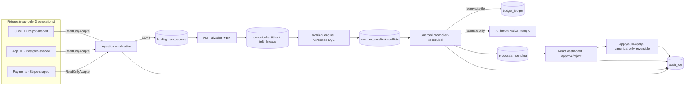

# Keystone — Design

## Architecture



Monorepo: `service/` (Python 3.12, FastAPI, uv), `dashboard/` (Vite + React + TS, pnpm), `seed/` (Python, inside service package as `recon.seed`), `rules/` (versioned SQL invariants), `golden/`, `docs/`, `infra/` (docker-compose, Render config).

Layer boundaries (each swappable): adapters → ingestion → normalization/ER → invariants → reconciler → proposal queue → query API → dashboard. The LLM client and the budget ledger are leaf dependencies of the reconciler only.

## Interfaces (contracts between tickets)

### ReadOnlyAdapter (service/recon/adapters/base.py)
```python
class ReadOnlyAdapter(Protocol):
    source_id: str                                   # "crm" | "appdb" | "payments"
    def generations(self) -> list[int]               # available snapshot generations
    def read(self, generation: int) -> Iterator[RawRecord]  # validated or raises AdapterError(kind, detail)
```
`RawRecord = {source_id, entity_type, natural_key, generation, payload: dict, row_hash}`. Adapters expose **no write methods** — the Protocol has none; adding one is a design violation. Malformed payloads raise `AdapterError` → HTTP 4xx `{error: {code, source, detail}}` + log. Timeouts bounded at 10s → structured error.

### Normalization module (service/recon/normalize.py) — THE shared spec (R23)
Single module imported by BOTH the seed generator and the detector. Pinned functions:
- `norm_email(e) -> str` — lowercase, trim; gmail.com/googlemail.com only: strip dots + `+suffix`. Never applied to other domains.
- `norm_name(s) -> str` — trim, collapse whitespace, strip stray quotes/backticks, casefold.
- `norm_enum(field, v) -> str` — canonical maps (state codes, grade formats), committed as data.
- `match_keys(entity) -> list[MatchKey]` — ordered, deterministic: (1) hard external id, (2) `norm_email`, (3) `(norm_name(first), norm_name(last), dob)`. Keys are candidates for ER; never automatic merges.

### Entity resolution (service/recon/er.py)
splink deterministic mode generates candidate pairs from match keys (blocking on the three key classes); a deterministic rule cascade decides link/no-link; survivorship per field = documented precedence (app DB > CRM > payments for identity fields; payments authoritative for money fields; most-recent-generation tiebreak). Fuzzy similarity scores feed **evidence signals only**, never link decisions. Output: `entity_links(canonical_id, source_id, source_key, method, generation)`.

### Invariant engine (service/recon/invariants/)
Each rule = one SQL file `rules/NNN_name.vX.sql` returning rows `(record_ref, entity_type, verdict, detail jsonb)`; runner stamps `(rule_id, rule_version, run_id)` into `invariant_results`. Undefined entity/field → verdict `unchecked`. Conflicts materialize into `conflicts` with `fingerprint = sha256(type | sorted(entity_refs) | field | sorted(observed_values))`.

### Confidence (service/recon/confidence.py) — deterministic, committed weights
`confidence = clamp01(base[conflict_type] + Σ w_i·s_i)` with signals: hard-external-id agreement (+0.35), exact normalized-email agreement (+0.25), name+dob exact (+0.20), amount/date corroboration (+0.10), per disagreeing field (−0.10), partial evidence (−0.15), oscillation observed (−0.25). Weights live in committed `confidence.yaml` (versioned); same conflict + evidence ⇒ same score. No LLM input to this number, ever.

### Reconciler (service/recon/reconciler.py)
Per conflict: build evidence packet → deterministic proposer picks the fix template for the conflict type → confidence → sensitive-field classifier (list per R15; classification wins over confidence) → dedup: if a non-rejected proposal with the same `fingerprint` exists, do not re-propose; if the underlying field oscillated across generations, mark conflict `escalated:oscillation` → LLM rationale call (skipped silently on failure; proposal still lands) → INSERT proposal `status='pending'` (or `sensitive_hold`). One proposal per conflict per run, idempotent on fingerprint.

### Budget ledger (service/recon/budget.py)
Single row per scope (`daily`, `run:<id>`). Reserve worst-case (from `max_tokens` × price table) BEFORE each LLM call via one atomic statement:
`UPDATE budget_ledger SET spent_microusd = spent_microusd + :reserve WHERE scope=:s AND spent_microusd + :reserve <= cap_microusd RETURNING ...` — zero rows ⇒ halt run, write `cap_hit` audit row, fire stubbed alert. Settle actuals (provider-reported usage) after the call, keyed by idempotency id; TTL sweeper reclaims dead reservations. Backstop: `CHECK (spent_microusd <= cap_microusd)`. Price table = committed `prices.yaml`.

### HTTP API (FastAPI)
- `POST /internal/sync` and `POST /internal/reconcile` — require header `X-Trigger-Secret: <per-job secret>`; 401 otherwise; idempotent per run id.
- `GET /health` — service + per-source adapter + DB reachability.
- Client API (header `X-Api-Key`): `GET /api/entities/{key}` (unified cross-source view: registered/paid/stage + per-field lineage), `GET /api/conflicts` (+ filters source/type/status, paginated), `GET /api/proposals` (+ filters), `POST /api/proposals/{id}/approve`, `POST /api/proposals/{id}/reject`, `POST /api/proposals/{id}/apply` (approved only; auto path per R24), `GET /api/incidents` (stretch #8 clusters), `GET /api/scorecard` (latest suite results for dashboard reconciliation).
- Scopes: client key → own scope rows only; `admin` scope → org-wide. Committed demo keys: one client, one admin.
- Errors: RFC7807-style `{type, title, status, detail}`; Pydantic validation → 422/400.

### Dashboard ↔ API
Dashboard consumes only the client API above (no direct DB) and authenticates with the committed **admin** demo key (reviewer actions require org-wide scope; the client demo key exists to prove isolation, not to drive the UI). Server-side pagination/filtering; TanStack Table; status rendered as icon+label (never color alone); approve/reject buttons post to the endpoints and optimistically refresh.

### Holds-before-writes enforcement (in code, not docs)
Two Postgres roles: `recon_writer` has INSERT on `proposals`/`audit_log`/`invariant_results`/`conflicts` and **no** UPDATE/DELETE/INSERT on canonical or landing tables; `apply_writer` (used only by the apply function) may UPDATE canonical tables and must write a `proposal_events` reversal record in the same transaction. Sources are files/fixtures — physically unwritable. This is the rationale's "enforcement boundary."

## Data models (Postgres, alembic-managed)

- `raw_records(id, source_id, entity_type, natural_key, generation, payload jsonb, row_hash, load_id, ingest_ts)` — append-only landing. Index `(source_id, entity_type, natural_key, generation)`.
- `entities(canonical_id uuid, entity_type, current jsonb, updated_at)` + `entity_links` (above).
- `field_lineage(canonical_id, field, value_text, source_id, generation, observed_ts)` — index `(canonical_id, field, generation)`; oscillation = window scan for value A,B,A.
- `invariant_results(run_id, rule_id, rule_version, record_ref, entity_type, verdict, detail jsonb, created_at)`.
- `conflicts(id, fingerprint unique, type, entity_refs jsonb, sources jsonb, disagreeing_fields jsonb, status, first_seen_run, last_seen_run)`.
- `proposals(id, conflict_id, fingerprint, action jsonb, confidence numeric, evidence jsonb, rationale text, status: pending|approved|rejected|applied|rolled_back|sensitive_hold, sensitive bool, created_run, decided_by, decided_at)`.
- `proposal_events(id, proposal_id, event, before jsonb, after jsonb, actor, ts)` — the rollback path.
- `budget_ledger(scope pk, cap_microusd, spent_microusd, updated_at, CHECK(spent_microusd<=cap_microusd))`.
- `audit_log(id, ts, actor, action, subject, detail jsonb, tokens_in, tokens_out, cost_microusd)` — privacy-safe mode: `detail` stores hash+preview unless `LOG_MODE=full`; stretch #10 adds redaction pass + `docs/retention-policy.md`.
- `api_clients(key_hash, scope, label)`.
- `incidents(id, centroid vector, label)` + `conflict_incidents` (stretch #8, pgvector).

## Decisions & rationale (do not "improve" these away)

- **No FDW.** Fixtures are static files; app-level adapters stamp lineage and keep the adapter port honest. Rejected: file_fdw/postgres_fdw.
- **Invariants are plain versioned SQL run by the service**, deliberately dbt-expectations-equivalent (ARCHITECTURE.md must say so and why: per-record verdicts are the grading contract; dbt `store_failures` overwrites per run and doesn't reliably emit full rows). Rejected: full dbt toolchain.
- **LLM is rationale-only.** LLMs are non-deterministic even at temp 0; determinism is graded; a raw LLM confidence number is disqualified by the brief. Rejected: LLM-selected fixes, LLM confidence.
- **Spend cap is in-app.** Gateways (LiteLLM) have shipped budget-bypass regressions; the cap is graded under burst. Rejected: proxy budgets.
- **Reserve-worst-case then settle** (not post-call accounting): post-call loses the concurrent-burst race. Size demo caps against worst-case reservations, not expected spend.
- **Scheduling = Render cron → HTTPS + shared-secret header.** pg_cron can't carry the mandated trigger header. Rejected: pg_cron, in-process schedulers.
- **Owned PRNG in the seed generator** (single seeded `random.Random` instance threaded through; dates as integer offsets from epoch 2026-01-01; money in cents; stable key ordering + sorted iteration; `json.dumps(..., sort_keys=True, ensure_ascii=True)`). Faker only for name/word corpora fed BY that PRNG index — never faker's date/uuid helpers (documented non-reproducible).
- **Gmail-only email canonicalization** — universal dot-stripping collapses legitimately distinct non-gmail addresses (false positives against the clean majority).
- **Auto-apply targets the canonical layer only**, never sources; separate function, separate DB role, reversal record in-transaction.
- **splink runs in deterministic mode for candidates only**; the link decision is a rule cascade. If splink fights the timebox, hand-rolled blocking on the same match keys is an approved fallback (same interface).

## Verification strategy

- CI (GitHub Actions, every push): `ruff check` + `pytest` + coverage gate ≥80% on `recon/{adapters,normalize,er,invariants,confidence,reconciler,budget}`; `pnpm lint` + `vitest`; axe-core a11y check on dashboard routes (Playwright).
- Committed harness `python -m recon.suite` prints the scorecard and exits non-zero on any failure: golden diff (0 FN/0 FP incl. compound-conflict overlap handling), clean-sample zero-flag check, cross-source join hash check vs `golden/expected-views.json`, proposal-safety (N conflicts→N pending; mirror byte-unchanged; C14 → `sensitive_hold`), oscillation dedup check, burst test (exact cap, no bypass), determinism check (two seeded runs → identical dataset hash, conflict set, confidence vector).
- Benchmarks in the same suite: query + dashboard p95 over 20 runs (k6), invariant pass wall-clock, ingestion rec/s. Latest scorecard output committed at `docs/scorecard.txt`.
- Ticket verify commands map onto these; nothing merges red.
