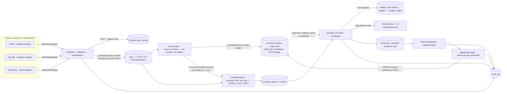

# Keystone — Design

## Architecture



Two shapes this diagram deliberately does **not** draw, because the code does not have them. There is no raw → staging → normalized three-step: `_materialize` (`service/recon/ingest.py:1117`) is called at `:1113`, inside `_land_records` (`:1034`), in the same transaction as the landing `COPY`, and calls `recon/normalize.py` directly, so `stg_*` *is* the normalized layer. And there is no arrow from the canonical layer into the invariant engine: every `FROM`/`JOIN` across all 15 files in `rules/` names only `stg_crm_contact`, `stg_crm_deal`, `stg_student`, `stg_enrollment`, `stg_payment` and the session-scoped TEMP `er_*` / `ref_*` tables that `service/recon/invariants/context.py` materializes. The canonical layer feeds the *reconciler* as evidence, not the detector. `ARCHITECTURE.md` §1 draws the same pipeline at file:line altitude.

Monorepo: `service/` (Python 3.12, FastAPI, uv), `dashboard/` (Vite + React + TS, pnpm), `seed/` (Python, inside service package as `recon.seed`), `rules/` (versioned SQL invariants), `golden/`, `docs/`, `infra/` (docker-compose, Render config).

Layer boundaries (each swappable): adapters → ingestion/normalization → ER → invariants → reconciler → proposal queue → query API → dashboard. The LLM client and the budget ledger are leaf dependencies of the reconciler only.

## Interfaces (contracts between tickets)

### ReadOnlyAdapter (service/recon/adapters/base.py)
```python
class ReadOnlyAdapter(Protocol):
    source_id: str                                   # "crm" | "appdb" | "payments"
    def generations(self) -> list[int]               # available snapshot generations
    def read(self, generation: int) -> Iterator[RawRecord]  # validated or raises AdapterError(kind, detail)
```
`RawRecord = {source_id, entity_type, natural_key, generation, payload: dict, row_hash}`. Adapters expose **no write methods** — the Protocol has none; adding one is a design violation. Malformed payloads raise `AdapterError` → HTTP 4xx as an RFC7807 problem document, media type `application/problem+json`: `AdapterError.problem()` (`service/recon/adapters/base.py:209`) returns `{type, title, status, detail}` plus whichever of `kind`, `source`, `entity_type`, `generation`, `natural_key`, `line`, `latency_ms`, `upstream_status` are set. `AdapterError.log_fields()` is the same facts, log-shaped. Timeouts bounded at 10s → structured error.

### Normalization module (service/recon/normalize.py) — THE shared spec (R23)
Single module imported by BOTH the seed generator and the detector. Every `norm_*` returns `None` rather than raising **for any value**, however dirty, so an unparseable value becomes verdict `unchecked` and never a disagreement. A programming error in the *caller* still raises, and is meant to: `norm_enum` on an unknown `field` (`normalize.py:490`), `norm_name` on a non-`str` (`:137`). Pinned functions:
- `norm_email(value) -> str | None` — casefold, trim, strip surrounding quotes/backticks; gmail.com/googlemail.com only: strip dots + `+suffix`. Never applied to other domains.
- `norm_name(value) -> str | None` — casefold, NFKD-fold accents, remove quote characters wherever they occur, collapse internal whitespace, trim. Never merges different spellings.
- `norm_dob(value) -> str | None` — canonical `YYYY-MM-DD`, else `None`.
- `norm_enum(field, value) -> str | None` — canonical maps (state codes, grade formats), committed as data.
- `match_keys(entity, entity_type=None) -> tuple[MatchKey, ...]` — ordered, deterministic, de-duplicated: (1) `("ext", <hard external id>)`, (2) `("email", norm_email(...))`, (3) `("namedob", (first_norm, last_norm, dob_norm))`; a key is omitted when its inputs are absent. Keys are candidates for ER; never automatic merges.

### Entity resolution (service/recon/er.py)
A hand-rolled deterministic cascade — `recon.er.resolve` — generates candidate pairs by blocking on the three `match_keys` classes and then decides link/no-link by rule. (splink was the pinned candidate generator and was dropped; §Decisions & rationale below approved exactly this fallback, "hand-rolled blocking on the same match keys … same interface", and it is what ships. `splink` is not a dependency and appears nowhere under `service/recon/`.) Survivorship per field = documented precedence (app DB > CRM > payments for identity fields; payments authoritative for money fields; **in-source tiebreak = the lexicographically smallest source ref** — for CRM contacts, the lowest `crm_id`; contract §4.6). Fuzzy similarity scores feed **evidence signals only**, never link decisions. Output, per contract §4.7 — **both** tables:
- `entity_links(canonical_id, source_id, source_key, source_ref, method, generation)` — accepted links only; `method` is the id of the first cascade rule that fired (`L1|L2|L3|P1|P2|P3|E1|E2|D2`) and is **never re-derived by a rule**. `R-004` consumes it, but not from this table: it joins the session TEMP `er_contact_student` (`rules/004_same_person_different_emails.v1.sql:32`), which carries the same `method` off the same cascade.
- `entity_link_candidates(source_ref, key_class, resolved_ref, generation, rule, accepted, detail)` — **every** match-key resolution, accepted or not, because the collapse `R-010` detects is visible only in the resolution the cascade discarded. `R-010` is evaluated over the candidate set and never over the accepted links — again through a session TEMP mirror, `er_candidate` (`rules/010_merge_collapsed_record.v1.sql:45`).

**Neither persisted table is read by any rule.** `service/recon/invariants/context.py` imports `recon.er.resolve` (`:34`) and re-runs it per invariant session (`:616`) into the session-scoped TEMP tables the SQL actually joins — `er_contact_student` (`:120`), `er_candidate` (`:142`) and the rest. The persisted pair is the reconciler's evidence and the API's lineage, never the detector's input.

Column names here are the shipped ones: `service/migrations/versions/0001_initial_schema.py:432` and `:454` create them, no later migration alters either, and `alembic upgrade head` is the authority over this list. On what a link *means* — the cascade, the key classes, which rule may consume which set — `docs/invariant-contract.md` §0's order of authority stands and is not amended here (brief PDF > that contract > every other doc in `docs/`, this one included). One caveat for the reader: that contract's §4.7 still spells `entity_links` with `link_class`/`resolved_ref` and `entity_link_candidates` with `decision`/`reason`, and those four are columns in no migration — so take the column lists from the migration.

### Invariant engine (service/recon/invariants/)
Each rule = one SQL file `rules/NNN_name.vX.sql` returning rows `(record_ref, entity_type, verdict, detail jsonb)`; runner stamps `(rule_id, rule_version, run_id)` into `invariant_results`. Undefined entity/field → verdict `unchecked`. Conflicts materialize into `conflicts` with the fingerprint **defined in contract §5.4** (`\x1f`-delimited over type, sorted `entity_refs`, sorted `disagreeing_fields` and `sorted(observed_values.items())` under `canon_value`). Do not restate it here — the contract governs.

### Confidence (service/recon/confidence.py) — deterministic, committed weights
`confidence = clamp01(clamp01(base[conflict_type] + Σ positive) + Σ negative)` — the positive half is clamped **first**, then the penalties are added and the result clamped again. Signals: hard-external-id agreement (+0.35), exact normalized-email agreement (+0.25), name+dob exact (+0.20), amount/date corroboration (+0.10), per disagreeing field (−0.10), partial evidence (−0.15), oscillation observed (−0.25); a signal joins the positive or the negative half by the **sign of its committed weight**. The formula, the 14 bases, the seven weights, the `NUMERIC(5,4)` quantization and the summation order are pinned in committed `confidence.yaml` (`formula:` and `version: 2`); same conflict + evidence ⇒ same score. No LLM input to this number, ever. **`ARCHITECTURE.md` §4 is the explanation** — in particular §"Why it clamps twice", which records that the single-clamp v1 form made every penalty on a positive-saturated proposal arithmetically invisible and so did not discharge R14's "partial/conflicting evidence lowers it". Do not restate the model here; `confidence.yaml` governs and ARCHITECTURE.md §4 explains.

### Reconciler (service/recon/reconciler.py)
Per conflict: build evidence packet → deterministic proposer picks the fix template for the conflict type → confidence → sensitive-field classifier (list per R15; classification wins over confidence) → dedup: if a non-rejected proposal with the same `fingerprint` exists, do not re-propose; if the underlying field oscillated across generations, mark conflict `escalated:oscillation` → LLM rationale call (skipped silently on failure; proposal still lands) → INSERT proposal `status='pending'` (or `sensitive_hold`). One proposal per conflict per run, idempotent on fingerprint.

### Budget ledger (service/recon/budget.py)
Single `budget_ledger` row per scope (`daily`, `run:<id>`). Reserve worst-case (from `max_tokens` × price table) BEFORE each LLM call, one reservation per scope inside a **single transaction** in sorted scope order. **The cap lives in the database; this module wraps it and does not implement one.** `recon_writer` holds no INSERT and no UPDATE on `budget_ledger` at all (migration 0005 revokes both — a Python-side cap once fell to a red team zeroing `spent_microusd`, so the writable spend column was deleted rather than guarded). Reserve is therefore one atomic statement against the append-only reservations table:
`INSERT INTO budget_reservations (scope, idempotency_key, reserve_microusd, model, max_input_tokens, max_output_tokens) VALUES (...)` (`service/recon/budget.py:1295`) — whose `BEFORE INSERT` trigger takes the ledger row lock, checks `spent + reserve <= cap`, and either increments spend or raises SQLSTATE `KS006`. The `model` and the two token bounds are the price binding, not decoration: the same trigger refuses the INSERT with `KS007` when a reservation names a `model` and its `reserve_microusd` is not exactly the worst case the committed rates give for those bounds (`0010_settle_evidence_binding.py:480-486`), so a caller cannot deflate the rates it will later settle against. A `KS006` ⇒ halt run, write `cap_hit` audit row, fire stubbed alert. Settle actuals after the call by `UPDATE(actual_microusd, state, settled_at, ...)`, `open -> settled` exactly once, keyed by idempotency id, at an amount the settle trigger **derives from the row itself** rather than one the caller names. A TTL sweeper closes a dead lease by `open -> settled` at the **full reservation**; `open -> reclaimed` is refused to `recon_writer` and belongs to the ops principal, because a capped party that can release a reservation it consumed has re-invented zeroing the spend. Backstop: `CHECK (spent_microusd <= cap_microusd)`. Price table = committed `prices.yaml`. `ARCHITECTURE.md` §3 states the enforcement boundary; `service/recon/budget.py`'s module docstring is the long form.

### HTTP API (FastAPI)
**Sixteen routes, and this list is all of them.** Counted off the route decorators in the seven mounted routers (ingest 1 + health 1 + internal 2 + entities 2 + review 8 + incidents 1 + scorecard 1); `README.md` §HTTP API tabulates the same sixteen, and `app.openapi()['paths']` on the running service is the authority over both.
- `POST /internal/sync` and `POST /internal/reconcile` — require header `X-Trigger-Secret: <per-job secret>`; 401 otherwise; idempotent per run id.
- `POST /internal/ingest/records` — lands a batch of literal payloads directly (`recon/ingest.py`); same `X-Trigger-Secret` door, carrying the **sync** job's secret, since it is the sync job that drives it.
- `GET /health` — service + per-source adapter + DB reachability. The only unauthenticated route.
- Client API (header `X-Api-Key`): `GET /api/entities/{key}` (unified cross-source view: registered/paid/stage + per-field lineage), `GET /api/entities` (the org-wide index — **admin scope only**, a client key gets 403), `GET /api/conflicts` (+ filters source/type/status, paginated), `GET /api/conflicts/{id}`, `GET /api/proposals` (+ filters, incl. `conflict_id`), `GET /api/proposals/{id}` (carries the `proposal_events` reversal ledger), `POST /api/proposals/{id}/approve`, `POST /api/proposals/{id}/reject`, `POST /api/proposals/{id}/apply` (approved only; auto path per R24), `POST /api/proposals/{id}/rollback` (R24's recorded reversal, admin scope, written as `apply_writer`), `GET /api/incidents` (stretch #8 clusters), `GET /api/scorecard` (latest suite results for dashboard reconciliation).
- Five of the sixteen — `POST /internal/ingest/records`, `GET /api/entities`, the two per-id GETs, and `POST /api/proposals/{id}/rollback` — plus the `conflict_id` filter, were **not** in this section when the dashboard was built against it. `dashboard/src/lib/contract.ts` keeps the ones it depended on in its numbered A1–A10 list (A2 the per-id GETs, A3 the `conflict_id` filter) as the record of what the client had to assume before the service pinned them; that list is parsed as data by `service/tests/api/test_contract_assumptions.py`, which now answers every id. Those entries are history deliberately not tidied away, not a live gap — read their `pinned:` notes as describing this section *as it stood then*.
- Scopes: client key → own scope rows only; `admin` scope → org-wide. Committed demo keys: one client, one admin (migration `0003_seed_api_clients`, hashes only).
- Errors: RFC7807-style `{type, title, status, detail}`; Pydantic validation → 422/400.

### Dashboard ↔ API
Dashboard consumes only the client API above (no direct DB) and authenticates with the committed **admin** demo key (reviewer actions require org-wide scope; the client demo key exists to prove isolation, not to drive the UI). Server-side pagination/filtering; TanStack Table; status rendered as icon+label (never color alone); approve/reject buttons post to the endpoints and optimistically refresh.

### Holds-before-writes enforcement (in code, not docs)
**Three** Postgres roles, partitioning propose / decide / apply, each a real login (never `SET ROLE`, which the same session can undo). Migration `0002_roles_and_grants` creates the first two, `0004_harden_write_boundary` narrows them to column lists, and `0005_three_role_boundary` splits deciding out of applying:

- `recon_writer` **PROPOSES**. INSERT on the detection path — `raw_records`, `ingest_runs`, every `stg_*`, `entity_links`, `entity_link_candidates`, `field_lineage`, `invariant_results`, `conflicts`, `proposals`, `audit_log`, `incidents`, `conflict_incidents` (`RECON_WRITER_INSERT`, `0002_roles_and_grants.py:118`) — plus INSERT on `entities` (`0004`), because the pipeline may *append* a canonical row even though only the guarded path may *mutate* one. UPDATE is granted only where a row's own lifecycle demands it (`ingest_runs`, `conflicts` — the three columns `status`, `last_seen_run`, `escalation_reason` after `0015` — `incidents`, `conflict_incidents`); **`proposals` and `entities` are absent from it**, so a proposal it wrote is a row it can never move and a canonical row is a row it can never change. DELETE is granted on the `stg_*` cache and nowhere else. No INSERT and no UPDATE on `budget_ledger` at all — `0002`'s INSERT list did name it, and `0005` revoked both (§Budget ledger).
- `review_writer` **DECIDES**. The only role that may move a proposal, and only through `UPDATE (status, decided_by, decided_at)`. It holds no INSERT on `proposals`: the decider may not create the work it then approves.
- `apply_writer` **APPLIES**. `UPDATE entities (current, updated_at)` — nothing else, so the reversal record provably restores what it changed — plus `UPDATE proposals (status)` only, so it cannot sign a decision as anyone, and it must write the `proposal_events` reversal record in the same transaction. Its INSERT on `entities` is revoked (`0004`).

Sources are files/fixtures — physically unwritable. This is the rationale's "enforcement boundary"; `ARCHITECTURE.md` §3 states it grant by grant, including the four things it does **not** guarantee.

## Data models (Postgres, alembic-managed)

These name the load-bearing columns; every table also carries its own `id`/`created_at` housekeeping, and `alembic upgrade head` is the authority over this list.

- `raw_records(id, source_id, entity_type, natural_key, generation, payload jsonb, row_hash, load_id, run_id, ingest_ts)` — append-only landing. Index `(source_id, entity_type, natural_key, generation)`.
- `stg_crm_contact`, `stg_crm_deal`, `stg_student`, `stg_enrollment`, `stg_payment` — the **normalized** layer, written by `_materialize` in the landing transaction and the only tables `rules/*.sql` read besides the session TEMP ones. A derived, re-materializable cache: the one place `recon_writer` holds DELETE.
- `entities(canonical_id uuid, entity_type, current jsonb, updated_at)` + `entity_links` (above).
- `field_lineage(canonical_id, field, value_text, source_id, source_ref, generation, observed_ts)` — one row per source per compared path per generation. `canonical_id` holds the contract's `person_key` (§4.1, §3); `field` is a source-qualified path from the `COMPARED_FIELDS` vocabulary and `value_text` is `canon_value(v)`. Index `(canonical_id, field, generation)`; oscillation = window scan for value A,B,A.
- `source_generations(source_id, generation, entity_type, expected_count, loaded_count, rejected_count, complete bool, run_id, error_detail)` — per-run completeness ledger; drives the `degraded` run marking and the absence-rule skip (contract §5.3).
- `invariant_results(run_id, rule_id, rule_version, record_ref, entity_type, verdict, detail jsonb, created_at)`.
- `conflicts(id, fingerprint unique, type, rule_id, entity_refs jsonb, sources jsonb, disagreeing_fields jsonb, observed_values jsonb, status, escalation_reason, oscillating bool, first_seen_run, last_seen_run)` — `recon_writer` may UPDATE only `status`, `last_seen_run` and `escalation_reason` (migration 0015); `oscillating` is settable on INSERT by the lineage scan and never after.
- `proposals(id, conflict_id, fingerprint, action jsonb, confidence numeric, evidence jsonb, rationale text, status: pending|approved|rejected|applied|rolled_back|sensitive_hold, sensitive bool, created_run, target_canonical_id, decided_by, decided_at, status_txid)`.
- `proposal_events(id, proposal_id, event, before jsonb, after jsonb, actor, ts, txid, canonical_id)` — the rollback path, and the citation a canonical write must carry in the same transaction.
- `budget_ledger(scope pk, cap_microusd, spent_microusd, updated_at, CHECK(spent_microusd<=cap_microusd))` — no application role may write it; spend moves only under the reservation triggers.
- `budget_reservations(id, scope, idempotency_key unique, reserve_microusd, actual_microusd, state: open|settled|reclaimed, model, max_input_tokens, max_output_tokens, settle_evidence, settle_proof, usage_*, created_at, settled_at)` — the **only** writable spend surface (migration 0005), append-only; its `BEFORE INSERT`/`BEFORE UPDATE` triggers are what move `budget_ledger.spent_microusd`.
- `audit_log(id, ts, actor, action, subject, detail jsonb, tokens_in, tokens_out, cost_microusd)` — privacy-safe mode: `detail` stores hash+preview unless `LOG_MODE=full`; stretch #10 adds redaction pass + `docs/retention-policy.md`.
- `api_clients(key_hash, scope, label)`.
- `incidents(id, centroid vector, label, embedding_model, embedding_dim)` + `conflict_incidents(incident_id, conflict_id, distance)` (stretch #8, pgvector). The embedding model is recorded on the row because a cluster is only comparable to others built with the same one.

## Decisions & rationale (do not "improve" these away)

- **No FDW.** Fixtures are static files; app-level adapters stamp lineage and keep the adapter port honest. Rejected: file_fdw/postgres_fdw.
- **Invariants are plain versioned SQL run by the service**, deliberately dbt-expectations-equivalent (ARCHITECTURE.md must say so and why: per-record verdicts are the grading contract; dbt `store_failures` overwrites per run and doesn't reliably emit full rows). Rejected: full dbt toolchain.
- **LLM is rationale-only.** LLMs are non-deterministic even at temp 0; determinism is graded; a raw LLM confidence number is disqualified by the brief. Rejected: LLM-selected fixes, LLM confidence.
- **Spend cap is in-app.** Gateways (LiteLLM) have shipped budget-bypass regressions; the cap is graded under burst. Rejected: proxy budgets.
- **Reserve-worst-case then settle** (not post-call accounting): post-call loses the concurrent-burst race. Size demo caps against worst-case reservations, not expected spend.
- **Scheduling = Render cron → HTTPS + shared-secret header.** pg_cron can't carry the mandated trigger header. Rejected: pg_cron, in-process schedulers.
- **Owned PRNG in the seed generator** (single seeded `random.Random` instance threaded through; dates as integer offsets from epoch 2026-01-01; money in cents; stable key ordering + sorted iteration; `json.dumps(..., sort_keys=True, ensure_ascii=True)`). Faker was to be used only for name/word corpora fed BY that PRNG index — never faker's date/uuid helpers (documented non-reproducible). *Outcome:* Faker was dropped entirely and is not a dependency; a name provider still has to be indexed by our own PRNG to be deterministic, at which point it is only a word list, so the word lists are committed in `service/recon/seed/corpora.py` and indexed by the owned `random.Random`. The decision is unchanged — this is the same rule, taken one step further.
- **Gmail-only email canonicalization** — universal dot-stripping collapses legitimately distinct non-gmail addresses (false positives against the clean majority).
- **Auto-apply targets the canonical layer only**, never sources; separate function, separate DB role, reversal record in-transaction.
- **splink runs in deterministic mode for candidates only**; the link decision is a rule cascade. If splink fights the timebox, hand-rolled blocking on the same match keys is an approved fallback (same interface). *Outcome:* the fallback is what shipped — `splink` is not a dependency and the whole cascade is `service/recon/er.py`, behind the interface this bullet pinned. The decision that the **link decision** is a rule cascade, never a model score, is unchanged and is the part that mattered.

## Verification strategy

- CI (GitHub Actions, every push): `ruff check` + `ruff format --check` + `alembic upgrade head` + `pytest`; `pnpm lint` + `vitest` + `pnpm build`; axe-core a11y check on dashboard routes (Playwright, with Chromium installed explicitly so the gate fails rather than skips). **CI does not measure coverage** — `.github/workflows/ci.yml`'s pytest step is bare `uv run pytest`, with no `--cov` and no `--cov-fail-under`, and `service/pyproject.toml` sets no `fail_under`.
- The coverage gate ≥80% on `recon/{adapters,normalize,er,invariants,confidence,reconciler,budget}` is enforced by the **`coverage` row of `python -m recon.suite`** (`recon/suite/coverage.py`), which is run by hand and is the only thing that fails on the floor. Naming CI as its enforcer would be a claimed control that does not exist.
- Committed harness `python -m recon.suite` prints the scorecard and exits non-zero on any failure: golden diff (0 FN/0 FP incl. compound-conflict overlap handling — **an unmatched detection is a false positive and an unmatched golden entry a false negative, independent of the clean sample**, contract §5.4), clean-sample zero-flag check, **`person_key` stability across ingested generations 1–3 (contract §9.2)**, cross-source join hash check vs `golden/expected-views.json`, proposal-safety (N conflicts→N pending; mirror byte-unchanged; C14 → `sensitive_hold`), oscillation dedup check, burst test (exact cap, no bypass), determinism check (two seeded runs → identical dataset hash, conflict set, confidence vector).
- Benchmarks in the same suite: query + dashboard p95 over 20 runs, invariant pass wall-clock, ingestion rec/s. They are **in-process Python ASGI** (`recon/bench/suite.py`) — no network, no TLS, no browser — and the scorecard says so at the head of its benchmark section. k6 was pinned here and never wired; nothing in the repo runs it. Latest scorecard output committed at `docs/scorecard.txt`.
- Ticket verify commands map onto these; nothing merges red.
